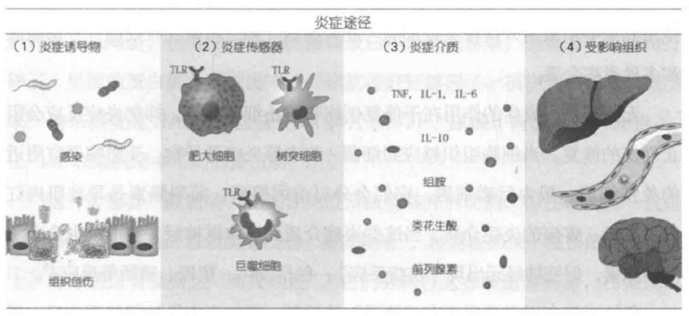
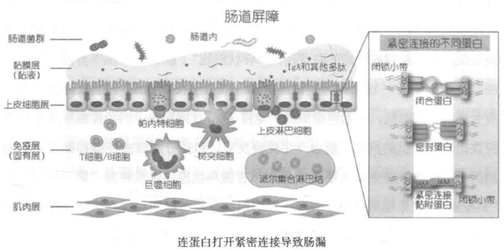
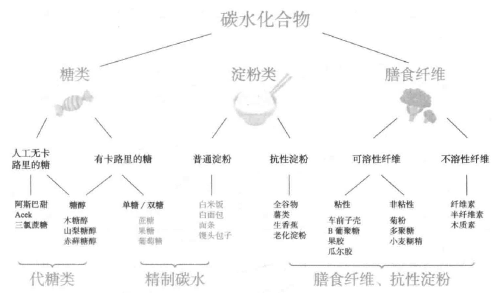
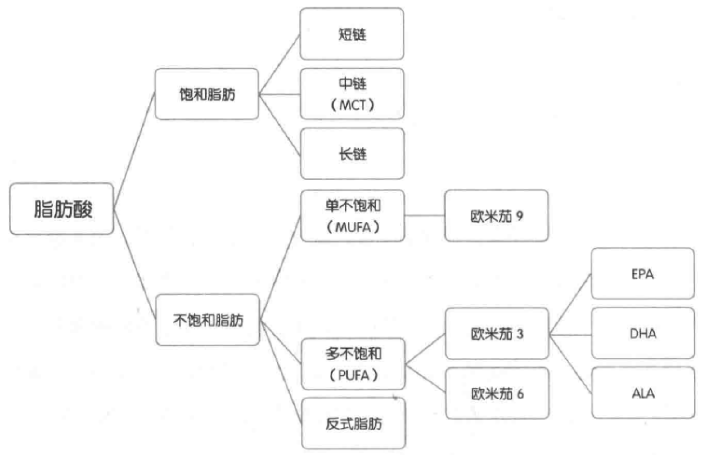
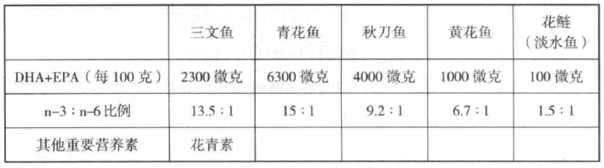

<!---
nav:
    - Home=/
left_pane: toc
right_pane: kws
--->

<ins type=book_bib title=循证抗炎饮食 author=维他 cover=imgs/cover.jpg link=https://book.douban.com/subject/36464101/></ins>

# 1 炎症的起源

## 没有炎症就没有慢性病

<mark name=baike>氧化应激</mark>是过多自由基造成的细胞损伤。
身体出现的所有慢性病都可能与身体氧化应激有关，出现感染或者局部炎症，然后免疫系统“接手”把它继续“做大做强”，最终导致更严重的健康问题。

炎症是身体的防御机制，作用在于发现并清除有害的外源物质，启动身体自愈过程：

* 急性炎症：一般源于微生物或者毒素入侵，或者是其他身体创伤。
* 慢性炎症：长期缓慢进展的炎症，可持续数月到多年的时间。

急性炎症有“消退”机制，一般有其生理意义，对健康有积极帮助（消灭感染源，组织修复）。
急性炎症持续下去变成慢性炎症，则对健康只剩下消极影响。
慢性炎症与糖尿病，癌症，心血管疾病，神经退行性疾病，自身免疫系统疾病，衰老等都有密切关系。

产生路径：
1. 炎症诱导物
    * 诱导物包括外来物质（pathogen-associated molecular patterns - PAMP）如细菌、真菌等微生物组成的片段物质
    * 身体的内源物质（damage/danger-associated molecular patterns - DAMP）如DNA碎片、ATP、尿酸等
2. 细胞传感器
    * 当传感器被触动
        * <mark name=baike>先天性免疫系统</mark>首先启动，<mark name=baike>中性粒细胞</mark>最先到达感染或受损现场，内吞细菌等病原，分泌炎症介质，导致痒痕和疼痛等。
        * 先天性免疫系统不能解决，则<mark name=baike>适应性免疫系统</mark>参与，免疫T细胞和B细胞参与清除病原体。
        * 再持续下去急性炎症就会发展成为慢性炎症。
    * 免疫细胞通过“<mark name=baike>模式识别受体</mark>”（pattern-recognition receptors - PRR）作为传感器识别诱导物。
        * 先天性免疫细胞的PRR很多时候只会感应细菌和细胞的**组成部分**，所以就算没有细菌感染，但血液中的细菌残留物，细胞损伤残留物也会触动传感器。
        * TLR4是免疫细胞表面受体，当接触到细菌的<mark name=baike>脂多糖</mark>（LPS）时，会启动细胞内的<mark name=baike>NF-κB</mark>转录因子路径，产生致炎症细胞因子。
          这里的细菌LPS是炎症诱导物PAMP，TLR4是传感器，致炎症细胞因子是炎症介质。
          <mark>除了PAMP，饱和脂肪也可以通过TLR4受体启动炎症反应</mark>。
        * NLRP3是免疫细胞中的受体，当接触到细菌来源的PAMP和损坏细胞的DAMP时，也会启动NF-κB转录因子路径，产生炎症细胞因子。
          当身体的氧化应激严重，过量的<mark name=baike>自由基</mark>（ROS）会增加NPLRP3的表达。
          <mark>因此，就算受损细胞没有变化，氧化应激会导致更多的致炎症细胞因子</mark>。
3. 炎症介质
    * 包括致炎症细胞因子和消退炎症细胞因子，是细胞间信息传递的信号。
      可以分几大类：
        * 白细胞介素（interleukin - IL）
        * 干扰素（interferon - IFN）
        * 肿瘤坏死因子（tumor necrosis factor - TNF）
        * 集落刺激因子（colony stimulating factor - CSF）
        * 趋化因子（chemokine）
    * 不同的炎症诱导物导致不同的炎症路径。
        * 病毒感染导致受感染细胞分泌IFN-α、IFN-β，唤起细胞毒性淋巴细胞。
        * 寄生虫感染导致肥大细胞和嗜碱性粒细胞分泌组胺、IL-4，IL-5、IL-13等。
4. 受影响的器官组织
    * 类风湿关节炎（RA）患者的氧化应激状况严重。
      研究发现，类风湿关节炎越严重，氧化应激指数和炎症指标都更高。
    * 炎症导致心血管疾病的机制：
        * 血管内皮细胞在炎症状态下分泌粘附因子VCAM-1，使单核细胞集中转化为致炎症巨噬细胞。
        * 巨噬细胞的PRR受体寻找氧化的低密度胆固醇载脂蛋白（oxLDL）并吞噬清除，没有氧化的LDL不受影响。
        * 过多的oxLDL让吃撑的巨噬细胞形成泡沫细胞，产生更多自由基和致炎症细胞因子，以召集更多的免疫细胞。
        * 凋亡后的巨噬细胞形成斑块，最终导致动脉粥样硬化。
    * 炎症和癌症的关系是多路径的。炎症的NF-κB转录因子路径已经证明是癌症的关键因素。
      氧化应激所产生的自由基和癌症的关系错综复杂，自由基增加癌症风险，但癌细胞分裂增殖则需要控制细胞内自由基不过量。
    * 关节炎是发生在关节软骨的慢性炎症。
      水果含有多酚类抗氧化物。
      临床实验表面17名关节炎患者连续12周吃冻干草莓，炎症标志物显著降低，关节疼痛显著改善。
    * 多种细菌可以导致牙周炎，但很多证据表明口腔以外炎症与牙周炎有紧密关系。
      减少碳水饮食可以减少小肠细菌和真菌过度生长，降低炎症，维生素C是水溶性抗氧化物，欧米伽3是缓解炎症的脂肪，维生素D介导免疫细胞往低炎症的亚型转化，从而缓解牙周炎。
    * 当破骨细胞介导的骨吸收和成骨细胞介导的骨形成失衡，骨质疏松就会出现。
      同样钙摄入情况下，减少身体氧化应激，缓解炎症可以降低骨质疏松风险。
      吸烟引起氧化应激，对骨骼健康不利。
      维生素C降低骨质疏松风险。
    * 小鼠实验显示眼压高只是青光眼的触发点，肠道健康时，眼压高并不导致持续炎症和青光眼，但肠道或口腔细菌失衡时，高眼压介导炎症就会通过免疫反应导致青光眼。

缓解慢性炎症：
* 减少精制碳水，增加膳食纤维，健康的脂肪组合
* 镁，胡萝卜素，生物类黄酮
* 大量蔬果，橄榄油，欧米伽3脂肪
* 运动锻炼

导致慢性炎症：
* 吸烟导致身体抗氧化物水平下降
* <mark>酒精通过多个不同细胞路径导致肠道，肝脏炎症。
  改变肠道菌群，导致肠漏，影响肠道内外免疫稳态，从而导致身体系统性炎症</mark>。

## 炎症出现的原因

* <mark name=baike>氧化应激</mark>（oxidative stress）是当身体在代谢过程中产生的氧化物包括活性氧（ROS）和活性氮（RNS）超过身体细胞的内源和外源抗氧化物的一种失衡状态。
    * ROS/RNS包括超氧化物（superoxide）、氧化氮、过氧化氢、羟基自由基（hydroxy了radicals）、过氧亚硝酸（peroxynitrite）等带负电极的分子。
    * ROS/RNS少一枚电子，碰到身体任何细胞中的脂肪、蛋白质和DNA等就掠夺其电子，造成细胞内不同物质的氧化，出现功能问题。
    * 抗氧化物可以捐献自己的电子给<mark name=baike>自由基</mark>，使之恢复平衡。
        * 抗氧化物有一部分是细胞内本身自有的，如谷胱甘肽（GSH）和超氧物歧化酶（SOD）。
          谷胱甘肽是细胞内最有效的抗氧化物，但氧化后需要其他抗氧化物帮它恢复活性。
        * 细胞内的外源抗氧化物一般需要的是脂性抗氧化物，否则难以进入细胞，如维生素E。
        * 细胞外的抗氧化物一般是水溶性的，可以在血液中就把自由基消灭，如体内产生的尿酸在细胞外是最主要的内源性抗氧化物，而维生素C是外源的水溶性抗氧化物。
        * 当身体产生的自由基超过内源和外源抗氧化物，就会出现氧化应激。
    * 体内产生的自由基，主要来源包括<mark name=baike>线粒体</mark>（mitochondria）和<mark name=baike>NADPH氧化酶</mark>（统称NOX家族）
        * 来自线粒体的自由基90%是生成腺苷三磷酸（ATP）时，电子传送链漏出的电子跟氧气的化学反应产生的线粒体自由基（mtROS）。
        * 来自NOX家族的自由基一般有其生理作用。
            * 低量自由基有细胞信号调节、细胞生长和凋亡的作用。
            * 免疫细胞在胞吞病菌后，页通过NOX家族产生大量自由基，来消灭病菌。
    * 炎症增加自由基产生，自由基又加剧炎症。
        * 炎症下，免疫细胞产生自由基，导致氧化应激。
        * 自由基可以直接启动细胞内NF-κB转录因子路径，产生炎症细胞因子。
            * 损坏的线粒体分泌更多的自由基，启动NLRP3受体，促使致炎症细胞因子分泌。
            * 氧化损坏的线粒体DNA（mtDNA）凋亡，产生DAMP，也可以启动NLRP3受体。
    * 自由基本身可以导致更多的自由基产生。
      线粒体和NOX有沟通信号，一方漏出的自由基增加会导致另一方产生更多的自由基。
* 自由基是导致炎症的直接因素。
  主要由三个独立的来源：
    * 炎性老化（inflammageing）：在衰老过程中出现跟感染无关的慢性轻度炎症。
      研究发现炎症年龄（利用血液炎症标志物计算）与样本人群全因死亡率有显著相关性。
      炎症年龄相对于实际年龄，对预判老人7年后的健康状况非常准确。
    * 代谢性炎症（metaflammation）：因为宏量营养过剩导致的代谢性疾病有关的慢性炎症。
      自然进化使得有效面对饥饿而不是营养过剩的人才能活下来。
      人体的机制能提高身体使用能量的效率和增加能量存储的方法，但对食物过剩的应对非常局限。
      <mark>餐后身体都出现大量的活性氧自由基，每一餐对身体都是一次氧化应激过程</mark>。
        * 对抗感染和加速细胞组织修复的免疫系统同样具有感应营养信号的受体：
            * 感应PAMP细菌炎症诱导物的TLR受体可以感应饱和脂肪。
            * 免疫细胞的游离脂肪酸受体（FFAR）可以感应不同的脂肪启动炎症或消退炎症反应。
            * 免疫细胞需要葡萄糖启动免疫反应，免疫反应增加消耗葡萄糖，免疫细胞也有<mark name=baike>胰岛素</mark>受体。
        * <mark>碳水化合物代谢产生葡萄糖，增加线粒体氧化压力，增加致炎症细胞因子，导致过量自由基产生</mark>。
        * 脂肪在血液中运送需要载脂蛋白：
            * <mark>餐后吸收的脂肪通过<mark name=baidu>乳糜微粒</mark>（chylomicron）从肠道运送到细胞组织</mark>。
            * <mark>肝脏不断产生的<mark name=baidu>甘油三酯</mark>则通过<mark name=baidu>极低密度脂蛋白</mark>（VLDL）运送到体内不同的细胞组织</mark>。
            * <mark>乳糜微粒和VLDL需要竞争细胞的载脂蛋白脂肪酶（lipopprotein lipase）从而延长在细胞为等待时间</mark>。
            * <mark>身体炎症状态下，血液中过多的自由基是载脂蛋白内的甘油三酯氧化。
              氧化的甘油三酯又造成细胞炎症，出现氧化应激。
              进食的高脂肪也会是乳糜微粒打包肠道中的脂多糖（LPS）在血液中刺激免疫系统</mark>。
    * 肠道菌群失衡（dysbiosis）：肠道菌群失衡导致慢性炎症。
* 诊断慢性炎症
    * 没有有效的化验手段诊断慢性炎症，C反应蛋白（CRP）是具有指导意义的炎症标志物，但它同时反应急性和慢性炎症，对炎症没有特异性，只能作为参考。
    * 常见病症：
        * 关节和肌肉疼痛
        * 慢性疲倦，失眠
        * 抑郁、焦虑和情绪问题
        * 肠胃问题，包括便秘、腹泻和胃酸反流
        * 体重显著上升或下降
        * 经常有各种感染
* 治疗和控制
    * 非甾体消炎药（NSAID），布洛芬和阿司匹林通过抑制前列腺素这个炎症介质分泌，达到缓解炎症作用。
    * 皮质类固醇（corticosteroid），目前多为糖皮质醇（glucocorticoids），脂溶性可以有效进入细胞，减少NF-κB转录，达到降低炎症作用。
    * <mark>他汀类药物可以降血脂，也有减少炎症作用。
      通过抑制甲羟戊酸途径的限速酶，减少胆固醇生成，但同时也减少了人体辅酶Q10的合成</mark>。
    * 二甲双胍是治疗糖尿病的药物，也具有抗炎作用。
      与上述药物抑制炎症介质产生不同，它可以启动细胞信号，增加细胞自噬活动，减少炎症诱导物。
    * 不推荐使用NSAID，因为会对肠道菌群造成负面影响：
        * 饮食中增加抗炎食物，戒糖控碳，减少<mark name=baike>反式脂肪</mark>摄入，增加全谷类和蔬果（牛油果，樱桃，脂肪多的鱼类）。
        * 锻炼和维持健康体重。
        * 增加睡眠，刺激人体生长荷尔蒙和睾酮分泌，有助身体自我修复。
        * 减少压力。
        * 不要抽烟，香烟是直接炎症诱导物，也会导致抗氧化物水平下降。
        * 减少喝酒，酒精导致肝脏炎症，改变肠道菌群导致肠漏，影响肠道内外免疫稳态，引发系统性炎症。

## 肠道菌群与炎症

* 肠道与中枢神经有双向沟通的途径，称为肠脑轴（gut brain axis）。
  肠道是身体接受外来输入（食物）的主要器官，肠道健康更能影响中枢神经健康。
* 肠道通透性（intestine permeability）俗称肠漏（leaky gut），是指肠道中的微生物或它们的代谢产物毒素等穿越失效的肠道屏障进入身体。
  这些细菌代谢物PAMP进入血液或到达其他器官组织，会促使身体产生免疫反应。
* 肠道屏障包括多层保护：
    * 微生物屏障：肠道表面的黏液为黏膜层，分外层和内层。
      外层有许多微生物菌落，好的共生菌多，有害细菌就无处落脚。
      不健康饮食导致肠道菌群失衡是肠道屏障破防的主因。
    * 生化屏障：黏膜内层接近肠壁上皮细胞，有大量抗菌蛋白，所以细菌较少。
      黏膜层就算内层也不是紧接肠壁细胞的，在蠕动波作用下不断把细菌往大肠方向推。
    * 物理屏障：黏膜下面只有一层肠上皮细胞，大部分是负责吸收营养的肠细胞，也有负责分泌例如黏膜层黏液的亚型细胞。
    * 免疫屏障：上皮细胞之下是大量的免疫细胞，包括巨噬细胞，免疫T和B细胞等。
      当免疫细胞接触到不应该出现的抗原，产生免疫反应，包括分泌致炎症或者抑制炎症的细胞因子。

* 肠道中的物质要穿过肠道屏障，有两个路径：
    * 跨细胞路径：通过细胞分泌的载脂蛋白、脂性渗透或细胞吞噬的方式进入上皮细胞再穿越。
        * 食物中的脂肪，矿物质离子和其他小分子营养素一般通过这种途径。
        * 细菌的细胞壁组成物脂多糖（LPS）是通过乳糜微粒，走跨细胞途径进入血液。
            * <mark>日常饮食中的油脂都是长链脂肪酸，肠壁细胞吸到细胞内的高尔基体，转化成甘油三酯后跟胆固醇打包成乳糜微粒，释放到淋巴和血液循环系统</mark>。
            * 肠壁细胞里的LPS会粘附乳糜微粒，被一同释放到血液循环系统中，刺激免疫细胞，产生炎症细胞因子。
            * LPS被等同为身体的“内毒素”。
            * 乳糜微粒是载脂蛋白的一种。
              短链和中链脂肪酸直接从小肠经门静脉运送到肝脏，无需载脂蛋白为载体，不会增加系统性LPS。
    * 细胞旁路径：大分子物质只能由肠壁细胞之间的细胞胖路径通过肠壁。
        * <mark>狭义的肠漏指的是细胞旁路径</mark>。
        * 上皮细胞之间有连接蛋白防止外来物穿过，主要有三大类蛋白：
            * 紧密连接蛋白（tight junction）
            * 黏着连接蛋白（adherens junction）
            * 桥粒蛋白（desmosome）
        * 紧密连接蛋白是第一道防线，这里破防就会出现肠漏，分几种亚型：
            * 密封蛋白（claudin）
            * 闭合蛋白（occludin）
            * 紧密连接黏附蛋白（junctional adhesion protein）
            * 闭锁小带（zonula occludens）
        * <mark>（解）连蛋白</mark>（zonulin）是肠上皮细胞分泌到肠道中的蛋白质，能通过上皮细胞的<mark name=baike>表皮生长因子受体</mark>（EGFR）信号，调节紧密连接蛋白的开关。
        * <mark hl_green>麸质</mark>和细菌可以促使解连蛋白分泌。
            * 麸质是在小麦、大麦和黑麦等谷物中发现的一组蛋白的统称。
            * 不要盲目长期进行无麸质饮食，因为含麸质食物都富含膳食纤维，对改善肠道菌群和肠漏有帮助。
        * <mark hl_green>高脂肪</mark>饮食可以导致肠漏（临床前和动物实验）。
            * 导致紧密连接蛋白减少，也会增加胆汁分泌，启动表皮生长因子受体（EGFR）信号，促使紧密连接打开。
            * 食增加氧化应激，氧化的脂肪损害肠壁上皮细胞，导致闭锁小带细胞功能失效。
            * 氧化应激导致炎症，致炎症细胞因子加剧肠漏。
            * 改变肠道菌群比例，肠粘膜中有更高比例降低肠道紧闭性的细菌，同样加剧肠漏。
            * 短期人类临床研究没有发现高脂肪饮食加剧肠漏，但会增加血液中的LPS，刺激免疫系统产生炎症反应，不能排除对肠漏造成的长期慢性影响。
        * <mark hl_green>糖和精制碳水化合物也可以导致肠漏（动物实验）。
            * 喂果糖的小鼠紧密连接蛋白功能受损，闭合蛋白和闭锁小带生成减少
            * 短期人类临床研究没有发现果糖和葡萄糖会增加肠漏风险。
        * 低到中等强度运动强化肠道屏障，超符合运动导致应激反应，引发肠漏。
        * 5%的<mark hl_green>酒精</mark>浓度可导致肠漏。
            * 酒精导致闭锁小带蛋白和闭合蛋白减少表达。
            * 20g乙醇（360mL啤酒或150mL葡萄酒）足以导致肠道通透性增加。
        * 非甾体消炎药可在使用后24小时内导致肠漏。
          抗生素降低肠道菌群多样性，使密封蛋白减少和致炎症细胞因子增加，导致肠漏。
* 三种普遍做法测试肠漏
    * 测试LPS抗体：肠漏发生时，细菌异物通过肠壁屏障进入血液循环系统，当中脂多糖（LPS）极易引发免疫系统反应，造成抗体。
      饮食中过量脂肪也可以导致血液中LPS过多，所以检查LPS对紧密连接蛋白有关的肠漏没有针对性。
    * 测试血液中闭合蛋白/连蛋白。
    * 乳果糖和甘露醇测试：甘露醇容易被吸收，可作为肠道吸收的标记；乳果糖不易被吸收，可以作为肠黏膜完整性的标记。
* 肠道菌群多样性
    * α多样性：只菌群的丰度，菌种菌株越多，α多样性越多。
    * β多样性：两个样本的菌群数量减去共有交集部分。
    * 高蛋白饮食不改变菌群丰度（α多样性不变），但会导致菌群结构改变（β多样性增加）。
      从高蛋白饮食回归到健康饮食，肠道菌群的结构改变会变慢（β多样性减少），也就是说恢复比较难。
      过多的动物蛋白会导致炎症。
    * 减少卡路里摄入（节食）可以显著改变肠道菌群，减少细菌，增加益生菌。
    * 饮食中较多的膳食纤维增加大肠短链脂肪酸，增加酸性，帮助抑制大肠病原菌。

# 2 饮食的必修课

## 增加大量蔬果

* 世界卫生组织建议每天进食5份或者400g的蔬果，蔬菜的定义不包括马铃薯，红薯等淀粉根茎类，也不包括豆类。
  我国膳食指南也建议每天有200-350g水果，餐餐有蔬菜，每天不少于300g，当中一半来自深色蔬菜。
    * <mark name=baike>深色蔬菜</mark>指的是深绿色、红色、橘红色和紫红色等的蔬菜，包括胡萝卜、番茄、紫甘蓝、红苋菜等。
      植物色素一般都是好东西，包括类胡萝卜素和多酚类抗氧化物等。
      多酚类中的生物类黄酮，是蔬果中的天然色素，包括花青素、白藜芦醇、槲皮素、芦丁、芹菜素、木犀草素、姜黄素等，具有改善慢性病和免疫系统疾病的作用。
    * 140万人群样本回顾显示<mark>十字花科蔬菜摄入可降低胃癌和直肠癌风险</mark>。
    * 叶菜含有丰富天然的<mark name=baike>硝酸盐</mark>，有助降低血压，改善心血管病风险。
      50家大学机构团队一致认为多吃蔬菜和增加蔬菜种类可以显著降低心血管疾病发病风险。
    * 蔬果含有丰富的维生素和矿物质，研究发现使用复合维生素无法达到 吃蔬果改善健康的效果，因为他们还富含膳食纤维和植物化合物。
* <mark name=baike>膳食纤维</mark>是不被人体吸收代谢的碳水化合物，可以顺利到达大肠。
    * <mark name=baike>不溶性纤维</mark>包括木质素、纤维素和半纤维素。
      含木质素的食物包括胡萝卜等根茎类食物，一般不被肠道微生物代谢。
      含纤维素和半纤维素的食物包括大部分叶菜，可被肠道某些细菌代谢，过程缓慢。
      因此不溶性纤维一般认为不被肠道细菌发酵代谢。
        * <mark>叶菜和花菜中不溶性膳食纤维较多</mark>，虽然不被小肠和肠道菌群直接利用，但经过大肠时会摩擦大肠黏膜层，让大肠细胞分泌水分，增加粪便体积和含水量，加快排出，改善便秘。
        * 肠道微生物优先代谢碳水化合物，当粪便在大肠停留时间过长，碳水化合物发酵完，细菌就增加代谢蛋白质，产生硫化氢等导致肠道炎症的化学物，对健康不利。
    * <mark name=baike>可溶性纤维</mark>不被人体吸收代谢，但到达大肠后可以被肠道菌群代谢，产生短链脂肪酸（SCFA）和血清素等细菌代谢物。
      包括聚果糖类，果胶，车前子壳，瓜尔胶和β葡聚糖。
        * <mark>全谷物和蔬菜水果含有大量可溶性膳食纤维</mark>。
          除了聚果糖类，其他可溶性膳食纤维都是黏性的，可溶于水形成啫喱状物质，减少脂肪吸收，减少肠道中脂多糖（LPS）通过载脂蛋白打包进入血液。
        * 果胶可以对胆汁起作用，减少脂肪的可溶性，减少吸收。
        * 容易发酵的可溶性膳食纤维如菊粉和多聚果糖，被大肠益生菌代谢产生短链脂肪酸（SCFA），促进大肠蠕动，增加紧密连接蛋白表达，改善肠漏。
* 叶菜与硝酸盐
    * 一氧化氮能调节放松血管内皮细胞，可有效降低血压。
    * 蔬菜中摄入的硝酸盐可被人体共生菌代谢为亚硝酸盐，最后在血管中生成一氧化氮。
      称为“<mark>硝酸盐-亚硝酸盐-NO</mark>（nitrate-nitrite-NO pathway）”途径。
    * 人体80%的无机硝酸盐来自蔬菜，包括芝麻菜、西芹、大白菜、生菜、甜菜根、菠菜、西葫芦和青豆。
      <mark>甜菜根汁被运动员作为功能饮料，因为增加一氧化氮可以提高运动表现</mark>。
    * 被吸收的硝酸盐，75%由于半衰期短，很快被肾脏排出，25%会到达唾液腺被存储。
      经常使用漱口水会减少代谢硝酸盐为亚硝酸盐的共生菌。
    * 加工肉类里添加的硝酸钠会转化为致癌物亚硝基胺。
      蔬菜含有的维生素C、多酚类抗氧化物可以防止硝酸盐形成亚硝基胺。
* 十字花类蔬菜与有机硫抗氧化物
    * <mark>十字花科类蔬菜包括西兰花、椰菜花、绿包菜（甘蓝）、紫包菜（紫甘蓝）、芥蓝、青菜、大白菜、油菜、芥菜、芜菁（turnip），羽衣甘蓝（kale）、孢子甘蓝（brussel sprouts）等。
      它们的价值在于其他蔬菜没有的<mark name=baike>有机硫抗氧化物</mark></mark>。
    * 硫是合成细胞内超级抗氧化物谷胱甘肽的辅助因子，对抗氧化和抗炎症有重要作用。
    * 其中最重要的是<mark name=baike>硫代葡萄糖苷</mark>（glucosinolates），本身不具备生物活性，需要黑芥子酶菜可以水解成活性成分。
    * 硫代葡萄糖苷和黑芥子酶都在十字花科类蔬菜内存在，但被纤维分开。
      切开和咀嚼后，底物和酶结合称为具有活性的异硫氰酸盐（isothiocryanates - ITC）。
    * ITC中，对我们健康最有利的是<mark name=baike>萝卜硫素</mark>（sulforaphane）。
      萝卜硫素可抑制多种癌症，降低心血管风险，改善自闭症和骨质疏松。
    * <mark>黑芥子酶热不稳定，煮熟的菜里萝卜硫素基本就没有了。
      因此适合生吃的沙拉，最好不要煮熟吃</mark>。
      肠道中也有黑芥子酶，可以代谢煮熟的十字花菜。
      经常吃十字花科蔬菜，肠道中代谢萝卜硫素的细菌会更多。
    * <mark>西兰花富含萝卜硫素，西兰花苗含量最高。
      萝卜硫素热不稳定，生西兰花含萝卜硫素是煮熟后的10倍</mark>。
    * 十字花科蔬菜可调节肠道菌群，改善身体炎症。
* 深色蔬菜和类胡萝卜素/花青素
    * 类胡萝卜素是蔬果中的脂溶性色素。
    * 人体血清中95%的类胡萝卜素主要有6中类型： α和β胡萝卜素、番茄红素、叶黄素、玉米黄素和β隐患素（cryptoxanthin）。
        * 蔬果中的类胡萝卜素，β胡萝卜素含量最多。
            * <mark>我们摄入的6成β胡萝卜素来自胡萝卜，其他菠菜、南瓜、香菜含量都不少</mark>。
            * 研究显示多吃胡萝卜可以降低心血管病风险，降低乳癌、前列腺癌风险
            * 相比吃胡萝卜，使用胡萝卜补剂对降低癌症风险没有太大帮助。
        * 番茄红素能降低LDL低密度胆固醇，减轻炎症，改善血管内皮功能，降低收缩压。
            * 食物来源的番茄红素85%来自番茄。
            * <mark>吃番茄比番茄红素补剂效果好</mark>。
        * 叶黄素和玉米黄素一般为水果中的黄色色素，深绿色蔬菜页包含。
            * 两者统称黄斑叶黄素，可以保护视网膜和晶状体免受光线导致的氧化应激。
            * 研究显示叶黄素和玉米黄素比胡萝卜素更适合作为预防衰老有关的眼疾。
        * 花青素在蔬菜中也非常丰富，<mark>茄子就有非常丰富的花青素</mark>。
            * 番茄、茄子和其他茄类食物可以降低身体炎症改善健康。
            * 茄子含有大量乙酰胆碱，可以舒张血管降低血压，可以通过抑制淀粉酶作用降低血糖。
* 多酚类抗氧化物
    * 多酚类是一种植物化学物，因化学结构都带有多个酚基团所以统称为多酚类。
      已经多酚类物质超过8000种，包括：
        * 黄酮类物质：茶叶中儿茶素、洋葱的槲皮素、芹菜中的芹菜素、柑橘类的柚皮素、豆类的大豆苷原、浆果和茄子含的花青素等。
        * 非黄酮类物质：咖啡含的咖啡酸、葡萄含的白藜芦醇、橄榄油含的橄榄苦苷、姜黄含的姜黄素等。
    * 多酚有很强的抗氧化功能，改善肠道菌群，是天然的益生元。
        * 抑制脂肪的吸收减少LPS进入血液。
        * 多酚类物质是多吃蔬菜能减少炎症的一个主要原因。
* 淀粉类蔬菜，薯类、南瓜、山药、莲藕增加糖尿病风险。
  可以吃，但不能多吃。
* 水果蔬菜都要吃。
    * 一个橙子含有100mg维生素C，吃茄子、西葫芦等需要2kg的量，生菜沙拉需要1kg的量。
    * 水果含糖较高，但页含有较多的可溶性膳食纤维。
    * 有些多酚类物质只在某些水果中存在，如葡萄皮含丰富的白藜芦醇，浆果含较多的花青素。
    * 由于热不稳定，蔬菜煮熟导致营养流失。
* 水果对改善健康的作用：
    * 橙子：含有生物类黄酮橙皮苷，可以减少葡萄糖和果糖在小肠的吸收代谢。
    * 生香蕉：改善血糖，降低低密度胆固醇氧化风险。
    * 苹果和梨：苹果皮含有苹果一半的膳食纤维和大量生物类黄酮抗氧化物（槲皮素），能够降低血压，改善心血管健康。
      吃苹果和梨可以降低血糖和血脂，降低瘦素浓度。
    * 西柚：提高高密度胆固醇HDL，改善体脂。
    * 猕猴桃：降低甘油三酯，增加高密度胆固醇HDL，提升维生素C和E的抗氧化物水平。
    * 西梅：改善骨质疏松，减少骨质流失。
    * 草莓：减少总胆固醇和LDL，降低氧化应激，改善炎症。
    * 蓝莓：有点最多的水果，降低血压，改善老年人认知能力，加强孩子语言记忆能力。
    * 蔓越莓：预防反复尿路感染。
    * 高糖水果，也有改善健康的作用，但不宜过量：
        * 西瓜：降低低密度胆固醇。
        * 樱桃：降低尿酸，降低炎症标志物CRP。
        * 芒果：含大量多酚类物质，改善代谢，改善肠道菌群。
        * 荔枝：提升运动表现，降低身体氧化应激。
        * 石榴：抑制小肠细菌过度生长，降低血压和炎症标志物，改善类风湿性关节炎。

## 戒糖和精制碳水化合物

* <mark name=baike>碳水化合物</mark>是三种宏量营养之一，另外两种是蛋白质和脂肪。
  碳水化合物又分糖类、淀粉类和膳食纤维。
    * 糖和精磨的谷物类淀粉是精制碳水化合物，缺乏营养，容易增加慢性病和各种代谢性疾病。
    * 抗性淀粉和膳食纤维不被人体肠道吸收代谢，但能够维持肠道菌群平衡，改善健康。
    * 精制碳水化合物是深加工的碳水化合物，除了卡路里不剩多少微量元素。
      糖和精磨的谷物是典型的精制碳水化合物。
    * 全谷物是指未经精细加工或者碾压粉碎等处理，仍保留完整谷粒具备的胚乳、胚芽、麸皮及其天然营养成分的谷物。
      简单理解就是“带皮”的谷物，包括糙米，全麦，全荞麦，全黑麦，小米，藜麦，燕麦等。

* <mark name=baike>升糖指数</mark>又称血糖指数（glycemic index或GI）全称为血糖生成指数，指吃下一定量食物后，单位时间内血糖升高速度。
    * 反映了某种食物与葡萄糖相比升高血糖的速度和能力。
    * 葡萄糖的GI是100，白糖的GI是65，白米饭的GI是73。
    * 每天食用高GI的食物越多，患上糖尿病的相对风险就越高，接近线性的正关系。
* 添加糖微量营养是零，戒掉添加糖的食物和饮料，把精制碳水化合物食物降到最低，是重获健康的重要一步。
    * 白糖（蔗糖）是双糖，由一个果糖分子和一个葡萄糖分子组成，比例是50/50。
      果糖和葡萄糖分子通过化学键连接在一起。
    * 高果糖家一般以玉米为原料加工支撑的甜味剂，最常见成分是55%的果糖和42%葡萄糖。
      果糖和葡萄糖分子是分离的。
    * 淀粉类碳水化合物在人体消化代谢后转化为葡萄糖，进入血液循环系统，胰岛素负责调节血糖，协助葡萄糖进入细胞作为能量原料。
    * 果糖不受胰岛素调节，代谢和葡萄糖完全不同：
        * 摄入果糖直达肝脏，代谢成甘油三酯和脂肪存储在肝脏。
        * 小鼠实验发现，<mark>适量吃水果时，小量果糖主要在小肠被代谢吸收</mark>。
        * <mark>过量的果糖会经过小肠到大肠，成为某些微生物的超级食物，破坏大肠菌群平衡</mark>。
    * 世卫组织建议糖占食物能量比例低于5%-10%，相当于25g，罐装可乐含糖大概是40g。
    * 精制碳水化合物导致血糖和胰岛素升高，促使饱腹感的荷尔蒙分泌减少，导致卡路里摄入增加。
    * <mark>低GI的食物能提供更强的饱腹感。
      而摄入精制碳水化物后，血糖上升更快。
      进食一段时间后，血糖降得更快，饥饿感更强烈</mark>。
    * 小肠是人体吸收营养的主要地方，<mark name=baike>小肠细菌过度生长</mark>（SIBO）会导致各种健康问题。
        * 粪便中的微生物只能反映大肠的状况，了解小肠特别是靠近胃部的十二指肠手段比较困难。
        * 食物在小肠走完全程只需2-5小时，在大肠停留则在24小时以上，肠道离胃部越远，细菌数量越多。
          小肠对微生物是非常恶劣的环境：
            * 食物经过小肠的时间短，且是间歇性的，无法快速反应的微生物没法获得足够的营养。
            * 接近胃部的近段小肠酸性较高，不适合大部分微生物生存。
            * 小肠的消化物除了酸性高，还有胆汁和各种消化酶，对微生物有抑制作用。
            * 十二指肠从胃部接收酸性消化物，促使胰脏分泌消化酶分解代谢食物和营养，而回肠末端低酸性环境更有利细菌生长，有助发酵到达肠后端的碳水化合物。
        * <mark>可能扰乱小肠菌群平衡，造成SIBO的因素</mark>：
            * 质子泵等抑制胃酸的药物
            * 饮食中糖和碳水化合物过多
            * 胆囊切除后源源不断的胆汁到达小肠
            * 过量的脂肪类食物使得胆汁过度分泌
            * 抗生素的使用
        * SIBO和慢性病有关联
            * 肥胖
            * 脂肪肝
            * 银屑病
            * 中枢神经（帕金森、益生菌）
            * 自身免疫系统疾病
* 人工甜味剂又称代糖，主要分两大类：
    * 人工合成的甜味剂或称为没有营养的甜味剂（non-nutritive sweetners），是人体不能吸收所以没有卡路里的甜味添加剂。
        * 常见的人工合成甜味剂有糖精、阿巴斯甜、安赛蜜、三氯蔗糖等。
        * 人工甜味剂不被肠道吸收，但会成为肠道某些细菌和微生物的超级食物，影响葡萄糖耐量，使部分人更容易患上糖尿病。
    * 有营养的甜味剂（nutritive sweeteners），包括高果糖浆和糖醇类高甜度的甜味剂，除热量外没有微量营养。
        * 糖醇是天然存在的糖，但现在一些糖醇被精炼成甜味剂，例如山梨醇、甘露醇、木糖醇和赤藓糖醇等。
        * 部分糖醇被肠道吸收，剩下部分被肠道微生物发酵，从而影响菌群平衡。
        * <mark>木糖醇和甘露醇可直接打开紧密连接，导致肠漏</mark>。
        * 赤藓糖醇是例外，大部分不被人体代谢，直接随尿液排出，剩下10%经过肠道，但暂时无证据显示赤藓糖醇会对肠道菌群产生影响。
        *

## 全谷物和抗性淀粉

* <mark name=baike>抗性淀粉</mark>不被人体代谢吸收，可直达大肠，产生类似膳食纤维的作用。
    * 全谷类和豆类中的淀粉被纤维性细胞壁包裹，淀粉酶没法对其分解。
    * 未成熟的水果和淀粉类蔬菜包括土豆、香蕉和苹果等是颗粒状的紧密淀粉结构，淀粉酶无法分解。
    * 薯类和谷物含的普通淀粉成为支链淀粉，加热后冷却出现老化，形成“直链淀粉”，结构难以被淀粉酶分解。
    * 抗性淀粉和膳食纤维为肠道微生物提供食物来产生我们所需的维生素等营养。
* 低GI食物一般也是抗性淀粉和膳食纤维高的食物。
    * 白糖和高果糖浆等是例外，成分里一半的果糖平均了葡萄糖的作用降低了GI。
        * 葡萄糖被吸收进入细胞提供能量，胰岛素负责调节血糖高低。
        * 果糖不受胰岛素调节，直达肝脏，经<mark name=baike>磷酸果糖激酶</mark>快速代谢变成甘油三酯和脂肪存储在肝脏。
    * 低GI食物容易产生饱腹感，不容易引起胰岛素波动。
        * 不容易在小肠被吸收，到达大肠进行代谢，产生<mark name=baike>短链脂肪酸</mark>，改善健康。
        * 能作为益生菌的食物，代谢产生丁酸等降低身体炎症，调节免疫系统。
    * 高GI食物快速被小肠代谢吸收，影响肠道菌群。
        * 胀气很多时候是因为肠道细菌发酵碳水化合物产生气体。
          食物走完小肠需要2-5小时才到达大肠，细菌在小肠而不是大肠发酵，出现胀气。
        * 胀气减慢胃部排空，细菌过度生长，食物提留在胃部时间过长，导致胃食管反流。
* 抗性淀粉分类：
    * RS1：物理包埋着的淀粉，例如全谷物的外皮或者植物细胞壁的包括，消化酶没法接触到里面的淀粉。
    * RS2：淀粉的葡萄糖结构的紧密程度影响他们被淀粉酶水解的速度。
        * 直链淀粉的葡萄糖分子紧密排列，淀粉酶没法顺利分解。
        * 支链淀粉则成树枝状，易于被分解成葡萄糖。
        * 含直链淀粉多和结晶比例高的淀粉是抗性淀粉，如生土豆和青的未成熟的香蕉和苹果。但薯类煮熟、淀粉糊化后抗性淀粉比例大幅降低。
    * RS3：普通淀粉或者RS2淀粉加热糊化后更容易被淀粉酶降解，但冷却后淀粉重新组合成结晶状态，产生RS3抗性淀粉，这个过程称作<mark name=baike>淀粉老化</mark>。
        * 直链淀粉含量多的，老化速度越快，可能只需几小时。
        * 支链淀粉多的如白米饭，可能需要24小时以上较低温度才能重新结晶成RS3.
    * RS4：人造抗性淀粉。
* 食物的烹饪方法影响抗性淀粉的含量。
    * 熟食中含有的抗性淀粉比生的少。
    * 淀粉在加热改变结构，冷却后会再改变，如生土豆抗性淀粉含量高达72%（RS2），煮熟后就大幅减少，冷却后又会增加一部分（RS3）。
    * 冷却后重新适度加热的高淀粉食物，抗性淀粉还是爆仓得比较好。
* 全谷物类比白米饭含有更多的抗性淀粉（RS1）和膳食纤维，而且微量元素也更多。
    * 全麦制品是以全麦面粉制作的产品，包括全麦面包和全麦面条等都是全谷物食物。
    * 成分表中排第一的是小麦粉就不算真正的全麦面包，尽量买有列出膳食纤维比例的全麦面包（6-10%）。
    * 糙米饭和白米饭维生素和卡路里含量差不多，但糙米饭含有更多的膳食纤维和矿物质。
    * <mark>稻米中含有砷是小麦等其他谷物的10倍，无机砷和它的代谢物包括甲基砷的细胞毒性较大</mark>。
    * 小米的升糖指数是59，低于白米和白面包。
      <mark>同样重量下，小米的膳食纤维比白面包高8倍，比白米高5倍</mark>。
      同样卡路里下，小米的微量营养特别是矿物质比白米亚多几倍。
      可以改善血糖，甘油三酯和低密度胆固醇，还能降低血压。

## 减少不健康的脂肪

* 脂肪的基本概念
    * 脂肪由碳、氢、氧三种元素组成的酸（一端是COOH）。
    * <mark name=baike>饱和脂肪酸</mark>是在整条脂肪的碳链中，碳原子和碳原子间的链接都为单键，两个相邻的碳原子共享一个电子的稳定状态，每个碳原子和氢原子都达到“饱和”状态。
        * 饱和脂肪的化学结构非常稳定，质保期长，耐高温，室温下呈固态（黄油、猪油、椰子油等）。
    * <mark name=baike>单不饱和脂肪酸</mark>（MUFA）是碳链中两个碳原子间是顺式双键（2颗电子）的脂肪酸。
        * 一般双键在第9和第10颗碳原子之间，所以又称为n-9。
          <mark name=baike>油酸</mark>（oleic acid）是MUFA的代表。
        * 单不饱和脂肪酸没有饱和脂肪酸稳定，需要更多的辅酶把它分开供身体作能量使用。
        * 含单不饱和脂肪酸的油包括橄榄油和牛油果油，都是健康的油。
    * <mark name=baike>多不饱和脂肪酸</mark>就是多个碳原子出现顺式双键。
        * <mark>多不饱和脂肪酸容易氧化，产生自由基</mark>。
        * 多不饱和脂肪如玉米油、葵花籽油和大豆油最好存放在不受到直接光照和阴凉的地方。
        * 根据碳链中第一个双键位置，又可分为n-3脂肪酸和n-6脂肪酸。
            * n-3脂肪酸对身体有益，特别是二十碳五烯酸（EPA）和二十二碳六烯酸（DHA），是鱼油富含的成分。
            * 最佳的n-3和n-6脂肪酸比例是1:1到1:4，但现代饮食中n-3严重不足。
    * <mark name=baike>反式脂肪</mark>又称氢化脂肪酸，天然脂肪中例如奶类脂肪只含有3%-5%的反式脂肪。
        * 平时接触到的典型反式脂肪产品是人造植物黄油，来取代牛油（黄油），因为认为牛油含有太多饱和脂肪不利健康。
        * 反式脂肪会减少高密度胆固醇，增加冠心病风险，对人体有害已经成为共识。

* 高脂肪食物需要肠道的载脂蛋白运转，这些载脂蛋白是乳糜微粒，可以把LPS从肠道带出来。
    * 脂肪酸中，只有<mark name=baike>长链脂肪酸</mark>需要乳糜微粒作为载体。
    * <mark name=baike>短链脂肪酸</mark>（SCFA）和<mark name=baike>中链脂肪酸</mark>（MCT）直接从小肠经由门静脉运送到肝脏，不需要载脂蛋白作为载体，所以SCFA和MCT不会增加系统性的LPS。
    * 日常饮食中的油脂都是长链脂肪酸，通过增加血液中的LPS等细菌识别物，导致系统性炎症。
* 身体的饱和脂肪（SFA）有两大来源。
    * 饮食中的肥肉等动物脂肪，植物脂肪也有一定的饱和脂肪。
    * 身体通过肝脏合成饱和脂肪，就算饮食中完全没有饱和脂肪，细胞线粒体可以通过<mark name=baike>脂质新生</mark>产生棕榈酸，在转化为其他饱和脂肪。
    * 减少饮食中的饱和脂肪并不能降低心血管病风险，因为高“质量”的饱和脂肪（来自牛奶、鸡蛋和黑巧克力等）不会增加心血管并风险。
    * 饮食中碳水化合物吃过了，会通过肝脏合成，增加血液中内源饱和脂肪的浓度。
    * 饱和脂肪容易溢出到肠道后段，改变肠道菌群，增加代谢性疾病风险，导致肥胖和脂肪肝。
    * 饱和脂肪本身足以直接刺激免疫细胞受体（TLR4），导致炎症细胞因子的分泌。
    * 交叉临床实验显示用不饱和脂肪取代饱和脂肪可以减少胆固醇在细胞的积累，降低心血管病风险。
    * 虽然血液中的饱和脂肪主要来源是肝脏产生而非饮食中的饱和脂肪，但当饮食中有一定比例的淀粉类碳水化合物时，人体优先代谢葡萄糖作为能量，这时候饮食中的饱和脂肪会直接增加血液中的饱和脂肪。
    * ??? <mark>专家建议用饱和脂肪取代欧米伽6脂肪，因为饱和脂肪稳定适合加热，而植物油中的欧米伽6过多加剧炎症，加热容易氧化。
      但从循证角度这对健康并不友好。饱和脂肪好处是热稳定，但也会引起炎症。
      使用饱和脂肪作为煮食用油并不健康。</mark>
* 高温加热的油导致身体氧化应激。
  一般家庭用的植物油如大豆油、花生油和玉米油等，是含有欧米伽6的多不饱和脂肪，在加热过程中会产生多种有害物质。
    * 过氧化氢是脂肪过氧化的产物，脂肪中的饱和程度月底，加热后油越不稳定，产生的过氧化氢越多。
        * 饱和脂肪稳定性最好，一个双键的单不饱和脂肪次之，多个双键的多不饱和脂肪最不稳定。
        * <mark>过氧化氢是自由基ROS的一种，我们的细胞膜组成也有大量的多不饱和脂肪，过氧化氢接触到细胞膜，会氧化细胞的不饱和脂肪，使细胞膜启动细胞信号，导致细胞内DNA出现损伤，增加癌症风险</mark>。
        * 这些可以导致细胞DNA损伤的氧化活动称为<mark name=baike>细胞毒性</mark>。
        * 煮食油加热一刻起，油的氧化就加速，加热时间越长，温度越高，使用次数越多，脂肪过氧化物就积累越多。
    * 高温加热氧化后的油，还会出现极性化合物，细胞接触后出现脂质过氧化，细胞中的蛋白质、磷脂和核酸也会被氧化，增加高血压、动脉粥样硬化、糖尿病、其他代谢疾病和癌症的风险。
* 中式烹饪油温容易超过220度，吸入因此产生的油烟增加肺癌风险。
    * 油烟对健康伤害最大的是致癌物<mark name=baike>多环芳烃</mark>（PAH），是一级致癌物。
    * <mark>研究发现油炸比煎食物产生多2倍的PAH，产生油烟最多的不是橄榄油，而是菜籽油</mark>。
    * <mark>橄榄油的多酚类抗氧化物，特别是“羟基酪醇“对肺癌油抑制和预防作用，而”橄榄油刺激醛“是橄榄油另一种多酚类物质，可以产生类似非甾体消炎药同样的抑炎症效果</mark>。
    * 研究分析连续不断炸油条的油含有大量极性化合物和PAH，吃了这些食物同样增加致癌风险。
    * 橄榄油可以减少油中的极性化合物和PAH，它的多种多酚类抗氧化物降低包括乳腺癌和其他癌症的风险，担心低烟点的粗榨橄榄油会增加肺癌风险时，最应该做的是降低煮食油温，而不是换成精炼植物油。
* 欧米伽3和欧米伽6
    * 欧米伽3（n-3脂肪酸）和欧米伽6（n-6脂肪酸）都是人体必须的脂肪酸。
    * n-6脂肪酸的亚油酸和n-3脂肪酸的α亚油酸，人体无法合成，必须从饮食中获得。
        * 亚油酸在不同酶作用下，人体合成其他n-6脂肪酸，如α亚麻酸和花生四烯酸。
          花生四烯酸是炎症介质。
          日常使用的煮食油含有大量亚油酸。
        * α亚油酸主要为植物来源，是EPA的前体，EPA是DHA的前体，同样需要辅酶帮助。
          EPA和DHA促使免疫细胞产生<mark name=baike>特异性促炎症消退介质</mark>（SPM），同时抑制花生酸系列细胞因子，抵消身体因n-6脂肪酸过多产生的炎症压力。
          α亚油酸在亚麻籽油和核桃中含量丰富，EPA和DHA主要来自海洋中脂肪丰富的鱼类。
        * n-6脂肪酸和n-3脂肪酸在代谢路径中竞争辅酶，过多的n-6脂肪酸会导致n-3脂肪酸代谢被抑制。

## 煮食油高温加热都会氧化

* 不同的食用油在不同的烹饪方式，不同的煮食温度都会影响我们的健康。
    * 大量研究证据已经证实橄榄油是健康的食用油，包括作为煮食油高温加热时产生更少的有害物质。
    * 每天摄入半汤勺的橄榄油（7g）全因死亡率下降19%，用橄榄油代替黄油、植物黄油等饱和释放和反式脂肪多的油，全因死亡率下降达34%。
    * 高油酸的山茶油也能降低氧化应激，而花生油对健康没有太多帮助。
    * 特级初榨橄榄油（EVOO）的多酚类抗氧化物起到抗炎作用，降低<mark name=baike>皮质醇</mark>。
      皮质醇是人体的应激激素，长期处于高水平增加各种健康风险，包括睡眠质量变差和失眠。
    * 橄榄油的精炼过程虽然增加了它的烟点，却减少了油中的多酚类抗氧化物。
      多酚类抗氧化物可以改善肠道菌群失衡和降低食用油在加热后的氧化和产生的有害物质。
* 烟点的误区
    * <mark name=baike>烟点</mark>就是油加热到冒烟的温度。
    * <mark>油的温度过热，油脂裂解变质，氧化的油对身体造成伤害，但烟点高的油未必就更健康</mark>。
    * 油加热后的稳定性衡量：
        * 氧气、水分加上高温会是油脂产生水解、氧化和聚合，产生游离脂肪酸和自由基，再而产生单酰甘油和双酰甘油等极性化合物（TPM）。
        * 动物实验证明在各种油脂的氧化指标下，TPM毒性最高。
        * 除此之外，三酰甘油聚合物（PTG）也对人体有害。
        * <mark>温度越高，加热时间越长，次数越多，油中的TPM和PTG比例就越高</mark>。
    * 研究证明烟点和油加热后的稳定性没有关系。
      烟点和脂肪酸的碳链长度有关，碳链较长的脂肪酸，烟点就高，但不代表烟点高的油加热后更温度。
    * <mark>实验显示橄榄油是加热后最稳定最安全的，加热后产生的极性化合物和反式脂肪最少，其实是椰子油和牛油果</mark>。
    * 芥花油表现最差，加热后产生的有害物质是橄榄油的一倍以上。
    * 烟点和油中的游离脂肪酸（FFA）有关，游离脂肪酸比例和油的精炼程度有关。
      精炼带来两个问题：
        * 精炼过程添加化学试剂。
        * 精炼去除的杂质页包括食用油里包含的大量多酚类物质。
          这些多酚类物质是对人体有益的抗氧化物，页同样保护油本身不被氧化产生有害物质。
    * <mark>含多酚类物质多的橄榄油，虽然烟点不高，但是加热后却是最稳定的，产生的极性化合物和其他有害物质最少</mark>。
    * 空气炸锅是油炸退而求其次的选择，其烹饪过程是“烤”而不适“炸”。
        * 高温下食物中的蛋白质和碳水化合物会出现美拉德反应，产生<mark name=baike>丙烯酰胺</mark>和<mark name=baike>晚期糖基化终末产物</mark>（AGEs）都会导致身体氧化应激。
        * 在同样180度的温度下，空气炸锅比传统油炸减少90%炸薯条产生的丙烯酰胺，也可以减少炸鸡的PAH和丙烯酰胺。

## 鱼类和欧米伽3脂肪

* 欧米伽3可以使肠壁细胞增加分泌<mark name=baike>肠碱性磷酸酶</mark>（IAP），具有抗菌和减少LPS毒素的能力。
    * n-6脂肪酸却会减少IAP。
    * 暂时没有途径直接为肠补充IAP，从食物中增加欧米伽3脂肪酸是我们能做的增加IAP的方法。
    * 通过降低炎症，欧米伽3的EPA和DHA可以改善血脂和降低心血管病风险，EPA比DHA对消退炎症和治疗心血管病更有效。
    * EPA和DHA可促进免疫细胞产生特异性促炎症消退介质（SPM），帮助消退炎症。
      SPM可以抑制n-6脂肪酸引起的炎症压力。
    * 研究发现高脂肪海鱼吃得越多的人，甘油三酯水平越低。
        * 食物中只有小部分海鲜含有较多的欧米伽3，包括冷水海鱼如青花鱼、秋刀鱼、沙丁鱼、金枪鱼、凤尾鱼和三文鱼，还有磷虾和海藻。
        * 每周吃2顿鱼可以补充足够多的欧米伽3是误导，因为经常食用的大部分鱼类，脂肪不多，缺乏欧米伽3脂肪酸。
    * 欧米伽3的转化路径是：ALA - EPA - DPA - DHA。
    * 海藻是海洋食物链中欧米伽3脂肪酸的源头。
* 容易买到的高脂肪海鱼
    * 青花鱼，秋天时最肥美，脂肪含量超过25%，100g鱼肉含有6.3g欧米伽3。
      春天脂肪含量只有4%。
        * 冷冻对欧米伽3影响比较大。
        * 鱼罐头也能改善健康。
    * 秋刀鱼，100g鱼肉含有DHA+EPA约4g。
        * 临床研究显示吃一餐秋刀鱼可以改善餐后血糖和脂肪一整天。
        * 煎和烤时DHA和EPA流失较少。
    * 三文鱼，每100g鱼肉，野生三文鱼含DHA+EPA约1.8g，我国常见的大西洋鲑含2.3-2.6g。
        * 还含有较多的<mark name=baike>虾青素</mark>，可以抵抗皮肤氧化，降低身体炎症。

* 吃鱼会增加重金属摄入，小雨在生物类前端，含量较小，鱼油生产过程清除了杂质和重金属。
* 欧米伽3改善多种健康问题：
    * 代谢性疾病
        * 阻止脂肪在肝脏积累，改善肝炎、胆固醇等。
        * 痛风患者血液中n-3脂肪酸浓度越低，痛风发病率越高。
    * 自身免疫系统疾病
        * 银屑病
        * 类风湿性关节炎
    * 精神健康
        * 改善抑郁症
        * 改善双相情感障碍

α  β
