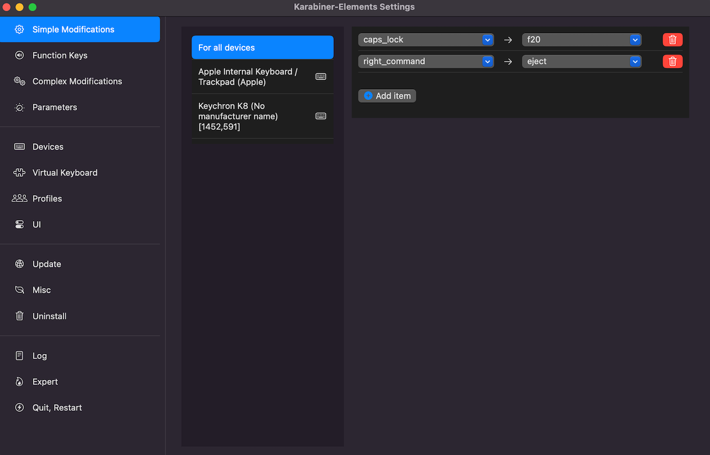
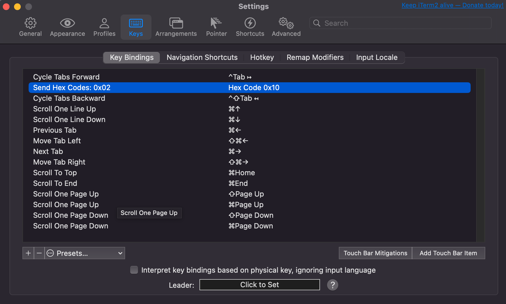

<!---
nav:
    - Home=/
--->


# TMux

## Installation

* [TMux](https://github.com/tmux/tmux/wiki/Installing)

* Setup all-in-one [config](https://github.com/gpakosz/.tmux)

    

* Change separator setting in .tmux.conf.local to use arrow
    ```
# status left/right sections separators
#tmux_conf_theme_left_separator_main=""
#tmux_conf_theme_left_separator_sub="|"
#tmux_conf_theme_right_separator_main=""
#tmux_conf_theme_right_separator_sub="|"
tmux_conf_theme_left_separator_main='\uE0B0'  # /!\ you don't need to install Powerline
tmux_conf_theme_left_separator_sub='\uE0B1'   #   you only need fonts patched with
tmux_conf_theme_right_separator_main='\uE0B2' #   Powerline symbols or the standalone
tmux_conf_theme_right_separator_sub='\uE0B3'  #   PowerlineSymbols.otf font, see README.md
    ```

* Add custom key bindings in `user customizations` section in .tmux.conf.local

    ```
bind-key -T copy-mode-vi 'v' send -X begin-selection
bind-key -T copy-mode-vi 'V' send -X select-line
bind-key -T copy-mode-vi 'r' send -X rectangle-toggle
bind-key -T copy-mode-vi 'y' send -X copy-pipe-and-cancel "reattach-to-user-namespace pbcopy"
bind | split-window -h
bind - split-window -v
bind p previous-window # select previous window
bind n next-window     # select next window
unbind '"'
unbind %
    ```

* Install [nerd-fonts](https://github.com/ryanoasis/nerd-fonts) if symbols are not showing properly

## Use `Caps Lock` key to send TMux prefix

* Go to `System Settings` -> `Keyboard` -> `Keyboard Shortcuts`

* In `Modifier Keys` tab, set `Caps Lock` Key to `No Action`

* Remap `Caps Lock` key to function key `F20` (captured as hex code 0x10) using [Karabiner](https://karabiner-elements.pqrs.org/)

    

* Open iTerm2 `Setting` -> `Keys`, in the `Key Bindings` tab, add a mapping from `Hex Code 0x10` to `Send Hex Codes: 0x02`

    


# Vim

* Install runtime path manager [Pathogen](https://github.com/tpope/vim-pathogen)

* Install [vim-sensible](https://github.com/tpope/vim-sensible)

* Install [vim-colors-solarized](https://github.com/altercation/vim-colors-solarized)

* Install [vim-go](https://github.com/fatih/vim-go)

* Update `.vimrc`

```
execute pathogen#infect()

" last position
if has("autocmd")
    au BufReadPost * if line("'\"") > 0 && line("'\"") <= line("$") | exe "normal! g`\"" | endif
endif

set re=0
" solarized color
syntax enable
set background=dark
let g:solarized_termcolors=256
colorscheme solarized

autocmd BufWritePre *.* :%s/\s\+$//e

"python
"let g:python3_host_prog="/usr/local/bin/python3"
"let g:autoformat_verbosemode=1
"au BufWrite *.py :Autoformat

"golang
autocmd FileType go noremap tl :GoDef<CR>
autocmd FileType go noremap th <C-o>
autocmd FileType go noremap tk :GoDoc<CR>
autocmd FileType go noremap <leader>b :GoBuild<CR>
autocmd FileType go noremap <leader>r :GoRun<CR>
autocmd FileType go noremap <C-k><C-k> <C-x><C-p>

let g:go_gopls_enabled = 1
let g:go_gopls_options = ['-remote=auto']
let g:go_def_mode='gopls'
let g:go_info_mode='gopls'
let g:go_referrers_mode = 'gopls'
"let g:go_def_mode='guru'
"let g:go_gocode_propose_source=0
let g:go_code_completion_enabled = 1

let g:go_metalinter_enabled = []

"let g:go_metalinter_command = 'golangci-lint'
"let g:go_metalinter_command = 'golint'
let g:go_metalinter_autosave = 1
"let g:go_metalinter_autosave_enabled = ['vet','revive','errcheck','staticcheck','unused','varcheck']
let g:go_metalinter_autosave_enabled = []
let g:go_rename_command = 'gopls'

filetype plugin indent on
set hlsearch
set nu
set cursorline
set paste
" show existing tab with 4 spaces width
set tabstop=4
" " when indenting with '>', use 4 spaces width
set shiftwidth=4
" " On pressing tab, insert 4 spaces
set expandtab

set viminfo='20,<1000
```


# .ssh

It is ok to copy over .ssh folders with existing private and public keys
