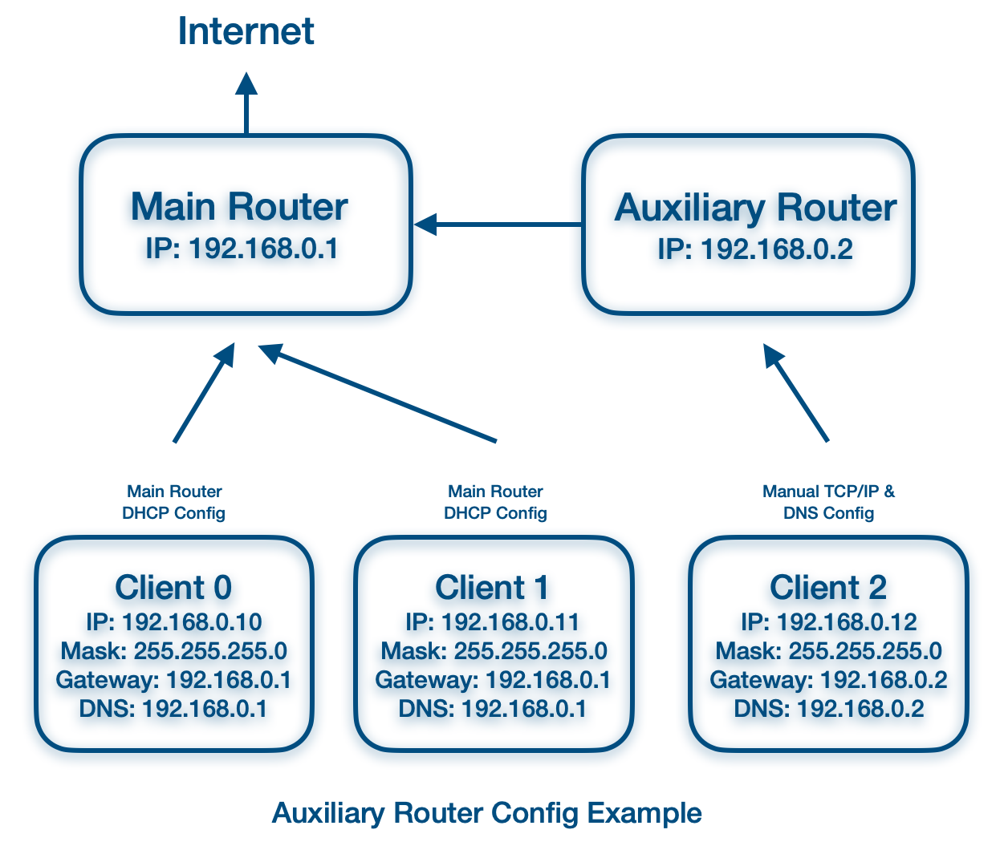

<!---
nav:
    - Home=/
--->

# Home Network Setup

The chart shows a setup where the traffic goes to the main router by default.
IP, subnet mask and DNS are assigned by the main router through DHCP.
No config is required on the client end.

The main router dials and connects to the Internet.
This is the most common and simple home network setup case.

If, on a special occasion, you want to direct traffic to go through the secondary router before accessing the Internet.
A manual TCP/IP and DNS setup can be used to override the default DHCP setting.
As shown in the chart, client2 always uses the auxiliary router as its gateway.

This is useful when you want the secondary router to handle special processing for specific devices but provide default and fast Internet access for the rest of the devices.
