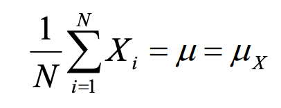
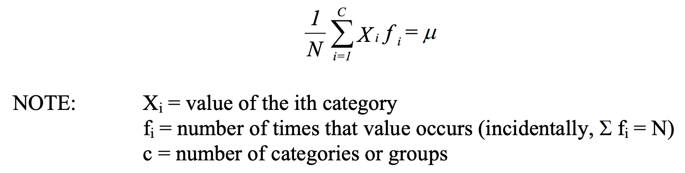
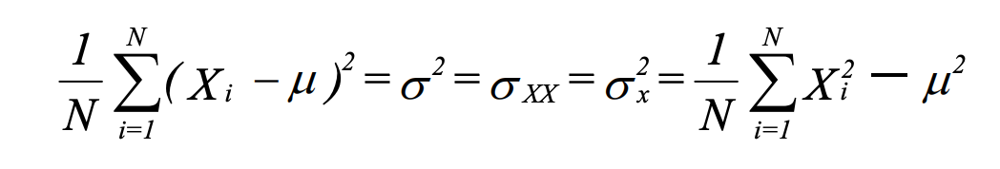
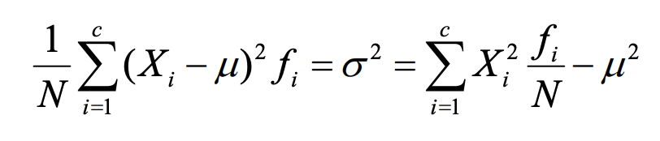
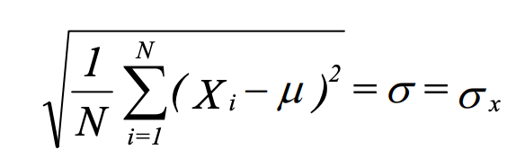

<!---
nav:
    - Home=/
    - Statistics=/trading/statistics/note.md
left_pane: toc
--->

# 1 Definitions

## Key Concepts

- Population:
    - The entire set of members in a group. EXAMPLES: All U.S. citizens; all Notre Dame Students.
    - All values of a variable in a definable group (e.g. Catholic, Protestant, Jewish)
    - The set of all values of interest
- Sample:
    - A subset of a population. We usually analyze samples - samples are supposed to tell us about the population.
    - Probability sample - a subset of the population for which all members had a known, non-zero probability of inclusion in the sample.
    - Random sample - a subset of the population for which all members had an equal probability of inclusion in the sample.
- Population parameters
     - Numerical characteristics of a population (the mean, median, mode are some of the simpler examples of population parameters)
- Sample statistics, or sample parameters
     - Sample estimates of population parameters.

## Levels of Measurement

The way we interpret the numbers we assign to our measurements depends upon the level of measurement that is used.

- Nominal
    - Nominal measurement is a classification system.
    - Use numbers instead of names to identify things.
For example, if we wanted to code religion, we might say 1 = Catholic, 2 = Protestant, 3 = Jewish, etc.
    - The numbers are arbitrary, and you can't perform mathematical operations.
    - Categories should be mutually exclusive and exhaustive.

- Ordinal
    - Categories are ranked in order of their values on some property.
Class ranks are an example (highest score, second highest score, etc.).
    - The distances between ranks do not have to be the same.
For example, the highest scoring person may have scored one more point than the 2nd highest, she may have scored 5 more points than the third highest.

- Interval
    - The distance between each number is the same.
For example, the distance between 1 and 2 is the same as the distance between 15 and 16.
    - We can determine not only that a person ranks higher but how much higher they rank.
    - You can do addition and subtraction with interval level measures, but not multiplication and division.

- Ratio
    - You can do addition, subtraction, and multiplication and division.
You have an absolute, fixed, and nonarbitrary zero point.

### Example

Fahrenheit and centigrade scales of temperatures are *interval-level* measures.
They are not ratio-level because the zero point is arbitrary.
For example, in the F scale 32 degrees happens to be the point where water freezes.
There is no reason you couldn't shift everything down by 32 degrees, and have 0 be the point where water freezes.
Or, add 68, and have 100 be the freezing point.
*The zero point is arbitrary*.
It is not correct to say that, *if it is 70 degrees outside, that it is twice as warm as it would be if it were 35 degrees outside*.

Such things as age and income, however, have nonarbitrary zero points.
If you have zero dollars, that literally means that you have no income.
If you are 20 years old, that literally means you have been around for 20 years.
Further, $10,000 is exactly twice as much as $5,000.
If you are 20, you are half as old as someone who is 40.

## Measures of Central Tendency

- Mode
    - Value that occurs most often.
    - Only appropriate measure for nominal data. Other measures make no sense.
- Median
    - Middle value in a set of numbers arranged in order of magnitude.
    - Most appropriate for ordinal data (uses only the rank order, ignores distance).
    - Is also sometimes good for interval and ratio level data that have some extreme values.
- Mean
    - Arithmetic average of all numbers.
    - Uses both rank order and distance between ranks.

Note: in a normal distribution, the mean, median and mode are all the same.

## Measures of Dispersion

We often want to know how much variability, or spread, there is in the numbers.
For example, suppose the average income is $25,000.
It could be that most people have incomes ranging from $24,000 - $26,000, or the range of values could be from $1,000 to $100,000.

Ideally:
- Be independent of the mean. You could add or subtract the same value to all cases, and the measure would not change value.
- Should take into account all observations, rather than just a few selected values.
- Should be convenient to manipulate mathematically.

Candidates:
- Range: absolute difference between the highest and lowest values.
- Variance: average squared deviation about the mean.
The variance meets all three criteria.

For a normal distribution (bell curve) about 68% of all values fall within one standard deviation to either side of the mean, and about 95% fall within 2 standard deviations.

Sample variance uses (N - 1) instead of N in the denominator.
Estimating the mean eats up 1 degree of freedom - 1 number cannot vary.
With large Ns, this is trivial.

## Shapes of Distributions

- Unimodal, Bimodal, or Multimodal: can have one or more modes.
- Symmetry: distribution has same shape on both sides.
- Skewed: not symmetric. If most of the values fall to the right of the mode, distribution is skewed positively.
With positive skew, Mean > Median > Mode.
We usually only worry about skewness in extreme cases.

## Univariate Statistics

- Population mean

- Population mean with a frequency distribution

- Population variance

- Population variance with a frequency distribution

- population standard deviation

