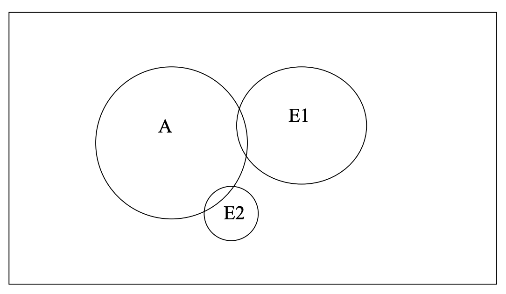
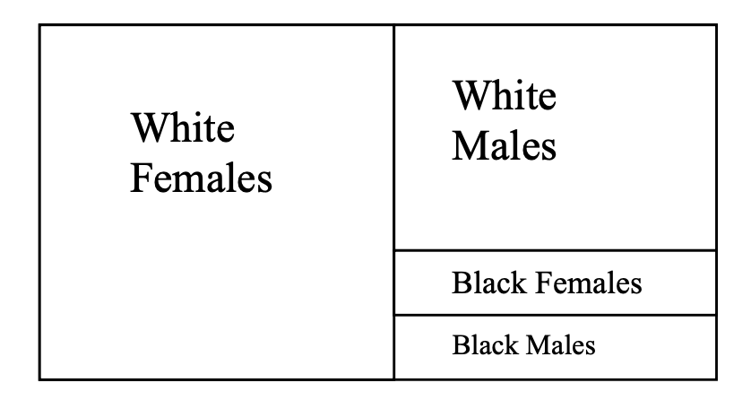
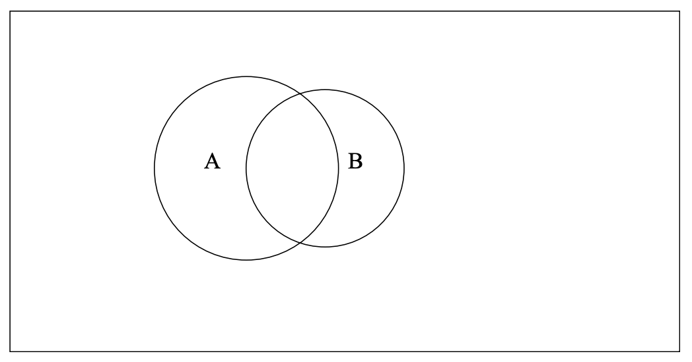

<!---
nav:
    - Home=/
    - Statistics=/trading/statistics/note.md
left_pane: toc
--->

# 2 Probability

| Concept | Meaning |
|---|---|
| Probability | A number between 0 and 1 that indicates how likely a specific event or set of events will occur. |
| Simple experiment | Some well-defined act or process that leads to a single well-defined outcome. For example, a coin toss will yield either a heads or a tails; a birth will yield either a boy or a girl. |
| Sample space | The set of all possible distinct outcomes of an experiment. For example, if you toss a coin once, the possible outcomes are H or T; toss it twice, and the possible outcomes are HH, HT, TH, and TT. |
| Sample point or elementary event | Any member of the sample space. One possible result of a single trial of the experiment. e.g., getting a Heads when tossing a coin; getting the Ace of Hearts when pulling a card from a deck. |
| Event or event class | Some subset of the outcomes of an experiment. Any set of elementary events. e.g. getting a “heart” when you pull a card from a deck is achieved by 13 different elementary events. |
| Mutually exclusive outcomes | Any set of events that cannot occur simultaneously. For example, for the variable GENDER, a person cannot be both male and female. Conversely, for ETHNICITY, an individual could claim both European and Asian ethnic heritages. |
| Independent events | Events that have nothing to do with each other. The occurrence of one event in no way affects the occurrence of the other. For example, the result of one coin toss does not affect the possible value of the next. |

## Axioms

- 0 ≤ p(Eᵢ) ≤ 1, where Eᵢ = Event i (A is often used instead of Eᵢ)
- p(S) = 1, where S is the sample Space
- When all sample points are equally likely, p(Eᵢ) = Number of elementary events in Eᵢ / Total number of possible events
- Total number of sample points = n₁ * n₂ * n₃ * ... * nₖ, where nᵢ is number of possible outcomes for the ith variable.
All outcomes need not be equally likely.
Hence, if you toss a coin three times, there are 8 possible outcomes.

## Probability Rules

Let A and B be two events of interest in a particular experiment.
Eᵢ means event i.

| Rule | General Rule | Rule for Mutually Exclusive Events | Rule for Independence |
|---|---|---|---|
| Complement, prob of no A | p(Ā)=1-p(A) | - | - |
| Conditional, prob of A given B | p(A\|B)=p(A∩B)/p(B) | p(A\|B)=0 | p(A\|B)=p(A) |
| Joint, prob of A and B | p(A∩B)=p(B)p(A\|B)=p(A)p(B\|A) | p(A∩B)=0 | p(A∩B)=p(A)p(B) |
| Additive, prob of A or B | p(A∪B)=p(A)+p(B)-p(A∩B) | p(A∪B)=p(A)+p(B) | p(A∪B)=p(A)+p(B)-p(A)p(B) |
| Marginal | p(A)=∑p(A∩Eᵢ)=∑p(Eᵢ)p(A\|Eᵢ) | - | - |
| Bayes' Rule (conditional probability) | p(Eᵢ\|A)=p(Eᵢ∩A)E/p(A)=p(Eᵢ)p(A\|Eᵢ)/∑p(Eⱼ)p(A\|Eⱼ) | - | - |

### Marginal

<mark hl>Marginal probability</mark> is the probability of some event happening, no matter what happens to other variables.
It is the overall (total) probability of one variable, averaging over other possibilities.

### Bayes' Rule

<mark hl>Another way of understanding Bayes' rule:</mark>

```
Joint rule:  p(A∩B) = p(B)p(A|B) = p(A)p(B|A)
Transformed: p(A|B) = p(A)p(B|A) / p(B)
```

- p(A): initial belief about A, called the **Prior**.
- p(B|A): how likely you would see B if A were true, called the **Likelihood**.
- p(B): overall chance of seeing B, called the **Evidence**.
- p(A|B): updated belief about A after seeing B, called the **Posterior**.

The rule reads as: Posterior = (Prior x Likelihood) / Evidence

Medical test example:

```
Let’s say a rare disease affects 1 in 1000 people.
You take a test that is 99% accurate (both for positive and negative results).
You get a positive test.
What is the chance you actually have the disease?

Setup:

p(Disease) = 0.001 (prior)
p(No Disease) = 0.999
p(Positive|Disease) = 0.99 (likelihood)
p(Negative|No Disease) = 0.99
p(Positive|No Disease) = 0.01 (false positive)

p(Disease|Positive) = p(Disease) x p(Positive|Disease) / p(Positive)

Where:

p(Positive) = p(Positive|Disease) x p(Disease) + p(Positive|No Disease) x p(No Disease)
            = (0.99 × 0.001) + (0.01 × 0.999)
            = 0.01098

Finally:

p(Disease|Positive) ≈ 0.0901 = 9.01%
```

Bayes’ rule is about reasoning in reverse.
You know how likely the test is to be positive if the person has the disease (test accuracy).
Once you see a positive test (which include true positive and false positive), you can calculate the chance a person actually has the disease.


### Examples

<mark hl>Other rules are easy, but knowing when to use them is tricky.</mark>
It is especially easy to mix up conditional probability, joint probability, and additive probability.
Here are some examples that might give you an intuitive feel for the different types of probabilities.

#### Example 1

5% of the population dies from heart attacks every year.
1% of all those aged 20-25 die from heart attacks every year.
10% of those aged 80 and above die from heart attacks every year.



The first statement gives the **marginal probability** of dying from a heart attack, i.e. if A = dying
from heart attack, then p(A) = 0.05.
Everything not within A represents people who do not die or who die from other causes.

However, as the next two statements show, the probability of dying from a heart attack varies by age.
These statements give the **conditional probability** of dying from a heart attack given your age.
Hence, if E₁ = aged 20-25 and E₂ = aged 80 and above, then p(A|E₁) = 0.01 and p(A|E₂) = 0.10.
Also, E₁ and E₂ are mutually exclusive events.

The areas where the circles overlap reflect their **joint probabilities**, e.g. the probability of dying from a heart attack and being age 80+, or p(A∩E₂).
If these were drawn perfectly, 1% of E₁ would overlap with A and 10% of E₂ would overlap with A.

If I know nothing about a person and I am asked to predict the probability of their dying in the next year from a heart attack, my best guess is 5%.
But, if I know their age, a likely better guess is given by the conditional probability of death given age.

<mark hl>That is what much of statistics is about: using information about people to better explain or better predict what happens to them.</mark>


#### Example 2

Of those who voted in a recent election, 50% were white females, 35% were white males, 9% were black females, and 6% were black males.



Here, you are given several **joint probabilities**, e.g. the probability of being both white and female = p(white∩female) = 0.50.

From the information given, you could easily determine the **marginal probabilities** for race and gender:
- p(White) = p(White∩Female) + p(White∩Male) = 0.85
- p(Black) = 0.15
- p(Female) = 0.59
- p(Male) = 0.41

#### Example 3

At a boys school, 10% of the students were on the football team and 8% were on the track team.
Half of the boys who played football were also on the track team.
Altogether, 13% of the boys were on at least one of the two teams, i.e. they were on the football team or the track team or both.



There are two **marginal probabilities** here: p(Football) = 0.10 and p(Track) = 0.08.

There is one **conditional probability** p(Track|Football) = 0.50.

There is one **additive probability**: p(Football∪Track) = 0.13.


---

∑
∩
∪
n₁
n₂
n₃
nₖ
p(Eᵢ)
p(Eⱼ)

