<!---
nav:
    - Home=/
    - Statistics=/trading/statistics/note.md
left_pane: toc
--->

# 4 Probability Distributions

## Random Variables

- **Random variable** is a well-defined rule for assigning a numerical value to every possible outcome of an experiment.
    - The sample space is called **S**.
    - All possible values of a random variable **X** is called the **support** or **space** of X.
    - X is a rule or function that map each s from **S** to one and only one x from the **support** of X.
- Typically, capital letters such as X, Y, and Z are used to denote random variables.
Lowercase letters such as x, y, z and a, b, c are used to denote particular values that the random variable can take on.
    - The expression p(X = x) symbolizes the probability that the random variable X takes on the particular value x.
Often written simply as p(x).
    - Likewise, p(X ≤ x) is the probability that the random variable X is less than or equal to the specific value x.
- If a random variable X can assume only a particular finite or countably infinite set of values, it is said to be a **discrete random variable**.
- **Discrete random variables** tend to be things you count, while **continuous random variables** tend to be things you measure.
- Probability distribution is a specification (in the form of a graph, a table or a function) of the probability associated with each value of a random variable.
    - Probability explains single events or a combinantino of events in an experiment.
    - Probability distribution explains all events in an experiment.

### Discrete Random Variables
- **Probability Mass Function (PMF)** describes the probability that a **discrete random variable** takes on a specific value.
It is specifically defined for discrete random variables.
    - same as p(X = x)
    - 0 ≤ p(X = x) ≤ 1
    - Σp(X = x) = 1
- **Cumulative Distribution Function (CDF)** describes probability that a random variable X takes on a value less than or equal to some particular value a is often written as:
    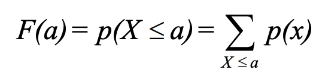

### Continuous Random Variables
- In general, for continuous random variables, the occurrence of any exact value of X may be regarded as having 0 probability.
For this reason, one discuss the probability that X takes on some value a, the so-called **probability density** of X at a.
Denoted by **Probability Density Function (PDF)**.
    - 𝑓(a) = probability density of X at a
- The **Cumulative Distribution Function (CDF)** is written as:
    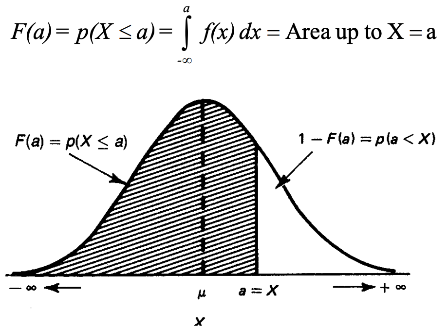
- The probability a continous random variable takes on any value between a and b:
    - p(a ≤ X ≤ b) = ∫𝑓(x)𝑑x for a ≤ x ≤ b
    - p(a ≤ X ≤ b) = 𝐹(b) - 𝐹(a)

## Permutations and Combinations

### Permutations

Permutation is an arrangement of objects in order.

    Total number of permutations of N objects = N! (N factorial)

    Where

    N! = 1 * 2 * 3 *...* (N-1) * N
    0! = 1

If some of the N objects are similar, such as N₁ objects are alike, N₂ objects are alike ... Nₖ objects are alike, and ΣNᵢ = N.

    The total number of permutations of these N objects = N! / (N₁!N₂!...Nₖ!)

If only r objects can be taken in each permutation.

    The total number of permutations of r objects of N objects = N! / (N - r)!

    Its notion is ɴPᵣ, where ɴPɴ is full permutation, i.e. N!

### Combinations

Combination represents number of ways of selecting r objects from N objects, irrespective of order.
In contrast, **ɴPᵣ** selects r objects from N objects and the order matters.

    The total number of combinations of r distinct of N objects = ɴPᵣ / ᵣPᵣ
                                                                = N! / (r!(N-r)!)

    Its notion is ɴCᵣ reads as N choose r.

Sometimes the number of combinations is known as a **binomial coefficient**, and sometimes the notation ɴCᵣ is used.

Combination is also often represented using following notion:

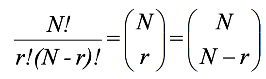

## The Binomial Distribution

### Bernoulli Trial

Many experiments share the common element that their outcomes can be classified into one of two events, one can be labeled as "success" and the other as failure.
A **Bernoulli trial** is each repetition of an experiment involving only 2 outcomes:
- p = probability of success
- q = probability of failure = 1 - p
- p + q = 1

We are often interested in the result of **independent**, **repeated** Bernoulli trials, i.e. the number of successes in repeated trials.
- Independent: the result of one trial does not affect the result of another trial.
- Repeated: conditions are the same for each trial, i.e. p and q remain constant across trials.
    - This is also referred to as a <mark hl>stationary process</mark>.
    - If p and q can change from trial to trial, the process is <mark hl>nonstationary</mark>.
The term **identically distributed** is also often used.

### Binomial Distribution

A binomial distribution gives us the probabilities associated with independent, repeated Bernoulli trials.

<mark hl>A **binomial distribution** describes the probabilities of those of</mark>
- <mark hl>receiving a certain number of successes, **r**,</mark>
- <mark hl>in **N** independent trials, each having only 2 possible outcomes,</mark>
- <mark hl>with the same probability of success, **p**.</mark>

The probability of getting r successes in N independent trials with each having p success probability:

    p(X = r; N, p) = number of ways event can occur * p(one occurrence)
                   = ɴCᵣ * pʳ * (1 - p)⁽ᴺ⁻ʳ⁾

More formally, in sampling a **stationary** Bernoulli process, with the probability of success equal to p, the probability of observing exactly r successes in N independent trials is:

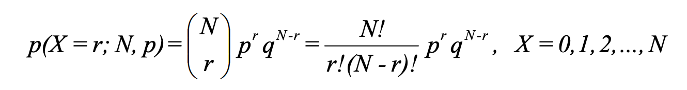

Another way of defining binomial distribution:

- Random variable Xᵢ = 1 if the ith Bernoulli trial is successful, 0 otherwise.
- Random variable X = ∑Xᵢ is the number of successes, where the Xᵢ are independent and identically distributed (**iid**).
- p(X = r; N, p) is a binomial distribution with parameters N and p.

### Mean and Variance

    Mean:
    E(Xᵢ) = Σxᵢp(xᵢ)
          = 0 * (1 - p) + 1 * p
          = p
    E(X) = E(X₁ + X₂ ... + Xɴ)
         = E(X₁) + E(X₂) + ...+ E(Xɴ)
         = Np

    Variance:
    xᵢ = xᵢ²
    V(xᵢ) = E(xᵢ²) - E(xᵢ)²
          = p - p²
          = p(1 - p)
          = pq
    V(X) = V(X₁) + V(X₂) ... + V(Xɴ)
         = Npq

### Shape

- For small p and small N, the binomial distribution is what we call skewed right.
That is, the bulk of the probability falls in the smaller numbers, and the distribution tails off to the right.

    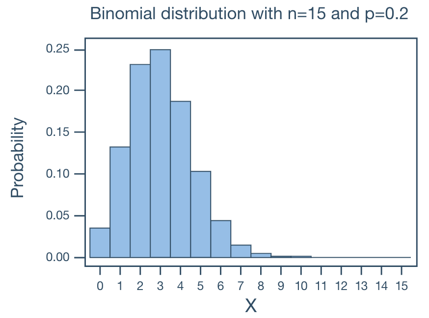

- For large p and small N, the binomial distribution is what we call skewed left.
That is, the bulk of the probability falls in the larger numbers and the distribution tails off to the left.

    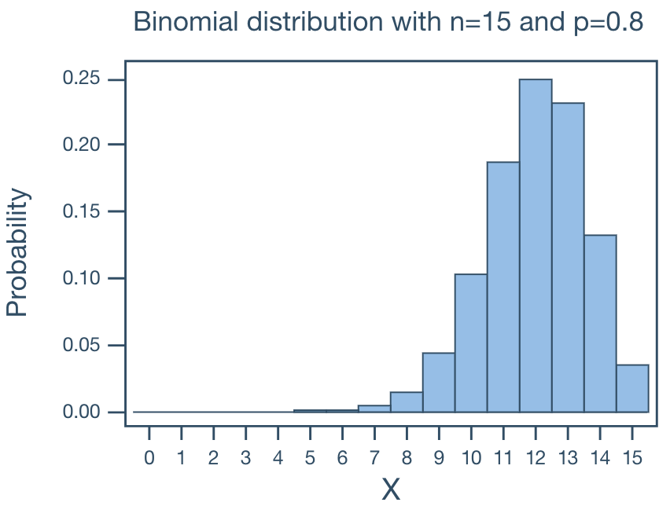

- For p = 0.5 and large and small N, the binomial distribution is what we call symmetric.
That is, the distribution is without skewness.

    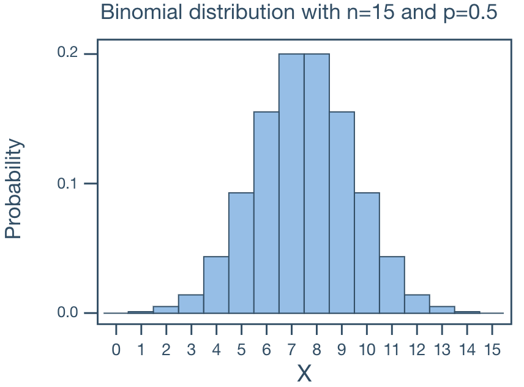

- When p ≠ 0.5, when N becomes large, the binomial distribution approaches symmetry.

    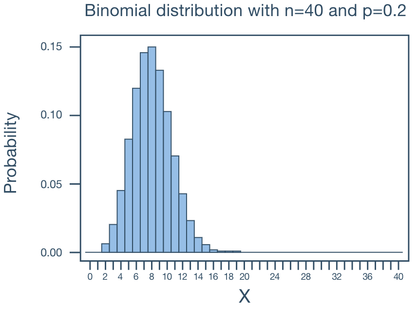

### Examples

    In a family of 11 children, what is the probability that there will be more boys than girls?
    Solve this problem WITHOUT using the complements rule.

    Solution:
    p(boy) = 0.5
    N = 11
    p(more boys than girls) = p(6, N, p(boy)) + p(7, N, p(boy)) ... + p(11, N, p(boy))
                            = 0.2256 + 0.1611 + 0.0806 + 0.0269 + 0.0054 + 0.0005
                            = 0.5

## The Poisson Distribution

The Poisson distribution models the number of times an event happens in a fixed interval of time or space when events occur independently at a constant average rate.
Examples of Poisson random variable:
- The number of typos on a printed page
- The number of cars passing through the intersection of Allen Street and College Avenue in one minute
- The number of customers at an ATM in 10-minute intervals

### Properties

- If X is a Poisson random variable, then the probability mass function (PMF) is:

    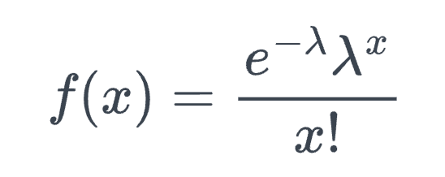

    - x = 0, 1, 2, ...
    - λ is the average rate of event occurrence per interval.
    - e ≈ 2.71828

- Verify ∑𝑓(x) = 1

    Taylor series for eˣ = ∑xᵏ/k! for k = 0, 1, 2, ...
    Now ∑𝑓(x) = ∑(e^-λ * λᵏ / k!)
              = e^-λ * ∑(λᵏ / k!)
              = e^-λ * e^λ
              = 1

- Mean and variance of a Poisson random variable are both λ.

- There are theoretically an infinite number of possible Poisson distributions.
Any specific Poisson distribution depends on the parameter λ.

- Let X denote the number of events in a given continuous interval.
It follows an approximate Poisson process with parameter λ > 0 if:
    - The number of events occurring in non-overlapping intervals are independent.
    - The probability of exactly one event in a short interval of length (1 / n) is approximately λ / n.
    - The probability of exactly two or more events in a short interval is essentially zero.

### Example

    Let X equal the number of typos on a printed page with a mean of 3 typos per page.
    What is the probability that a randomly selected page has at least 1 typo on it?

    Solution:
    p(X ≥ 1) = 1 - p(X = 0)
             = 1 - e⁻³3⁰ / 0!
             = 1 - e⁻³
             = 0.9502

    What is the probability that a randomly selected page has at most 1 typo on it?
    Solution:
    p(X ≤ 1) = p(X = 0) + p(X = 1)
             = e⁻³3⁰ / 0! + e⁻³3¹ / 1!
             = e⁻³ + 3e⁻³
             = 0.1992

### Approximating the Binomial Distribution

The Poisson distribution can be viewed as the limit of binomial distribution.
Suppose X ~ Binomial(N, λ/N) where N is very large and λ/N is very small.
We show that the PMF of X can be approximated by the PMF of a Poisson(λ).

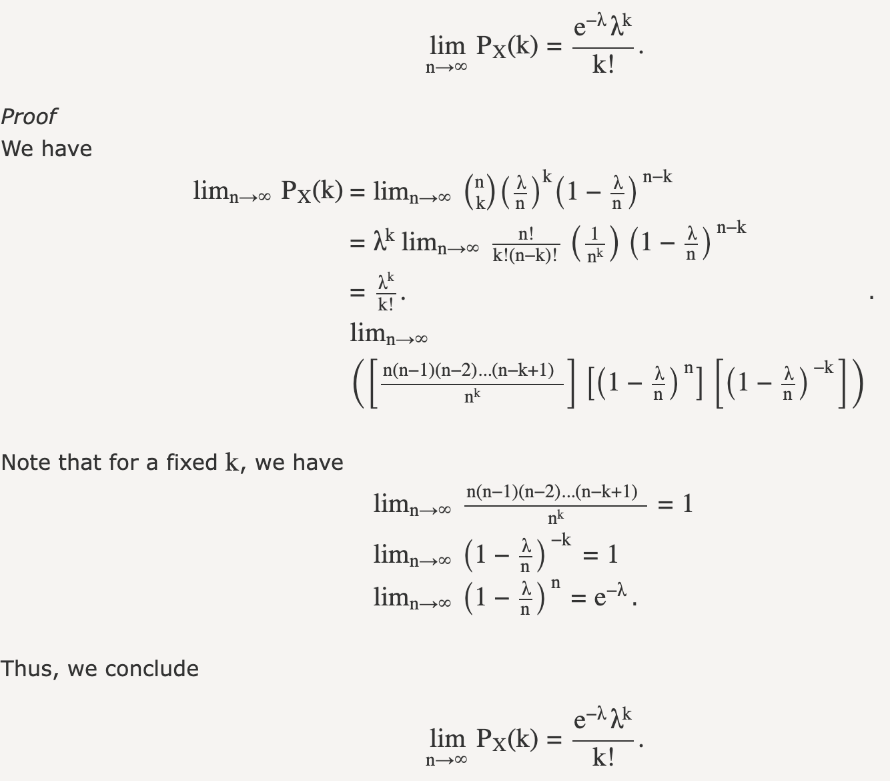

In the screenshot, n is the Binomial distribution parameter N.
λ is the Poisson distribution parameter.
λ/N is the Binomial distribution parameter p.
The k is the fixed value for Poisson random variable.

An intuitive understanding is that when N becomes larger, the Poisson interval is divided into N smaller sub-intervals (λ/N).
The the sub-interval becomes sufficiently small, it can guarantee only one event happens in each sub-interval.
<mark hl>If we regard an event occurrence in a sub-interval as a "success" in binomial distribution, then the following 2 probabilities are equivalent:</mark>
- <mark hl>**The probability of k event occurrences (known average rate of λ) in an interval**</mark>, i.e. Poisson distribution
- <mark hl>**The probability of receiving k successes in N independent trials with probability of success λ/N**</mark>, i.e. binomial distribution

***This is useful because Poisson PMF is much easier to compute than the binomial***.

## Normal Distributions

### Properties

- Symmetric, bell shaped.
It describes data that clusters around a mean with symmetric spread.
- Continuous for all values of X between -∞ and ∞ so that each conceivable interval of real numbers has a probability greater than 0.
- -∞ ≤ X ≤ ∞
- Two parameters, µ and σ. <mark hl>Note that the normal distribution is actually a family of distributions, since µ and σ determine the shape of the distribution.</mark>
    - Mean (μ): controls the center
    - Standard deviation (σ): controls the spread
- Probability density function (PDF):

    

- The notation N(µ, σ²) means normally distributed with mean µ and variance σ².
If we say X ~ N(µ, σ²), we mean that X is distributed N(µ, σ²).
- About 2/3 of cases fall within 1 standard deviation of the mean, that is:

        p(µ - σ ≤ X ≤ µ + σ) = 0.6826

- About 95% of cases fall within 2 standard deviations of the mean, that is

        p(µ - 2σ ≤ X ≤ µ + 2σ) = 0.9544

    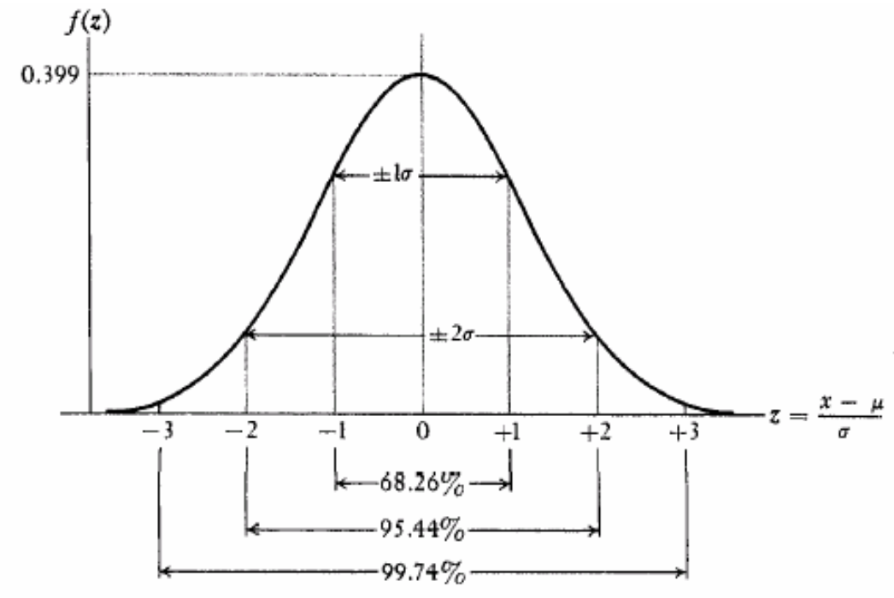

### Applications

- Many things actually are normally distributed, or very close to it.
For example, height and intelligence are approximately normally distributed; measurement errors also often have a normal distribution.
- The normal distribution is easy to work with mathematically.
In many practical cases, the methods developed using normal theory work quite well even when the distribution is not normal.
- There is a very strong connection between the size of a sample N and the extent to which a sampling distribution approaches the normal form.
**Many sampling distributions based on large N can be approximated by the normal distribution even though the population distribution itself is definitely not normal**.

Usage in time series:

- Assumption for returns: many models (ARIMA, Kalman filter, etc.) assume residuals/errors are normally distributed.
Even though crypto returns are not perfectly normal, log returns of large assets often approximate normal over short periods.
- Confidence intervals: if residuals are normal, we can compute forecast intervals: mean ± 1.96 x σ for 95% CI.
- Risk models: value-at-Risk (VaR) often assumes normal returns (or uses a fat-tailed correction).

### Rules

- Working with **PDF** is tedious.
The trick is to convert arbitrary normal distribution with µ and σ into a standardized normal distribution N(0, 1), i.e. µ = 0 and σ = 1.
    - If X ~ N(µ, σ²), then Z = (X - µ) / σ ~ N(0, 1)
    - There is precomputed probability lookup table for N(0, 1).
    - Convert back to X = Zσ + µ
- N(0, 1) Lookup table and how it works can be found [here](https://en.wikipedia.org/wiki/Standard_normal_table#Reading_a_Z_table)
- Define CDF as 𝐹(x) = p(X ≤ x):
    - Rule #1

            p(Z ≤ a) = 𝐹(a)         when a is positive
                     = 1 - 𝐹(-a)    when a is negative

            Due to the symmetry of the curve, when 𝐹(a) > 0.5, a > 0, and
                                              when 𝐹(a) < 0.5, a < 0.

        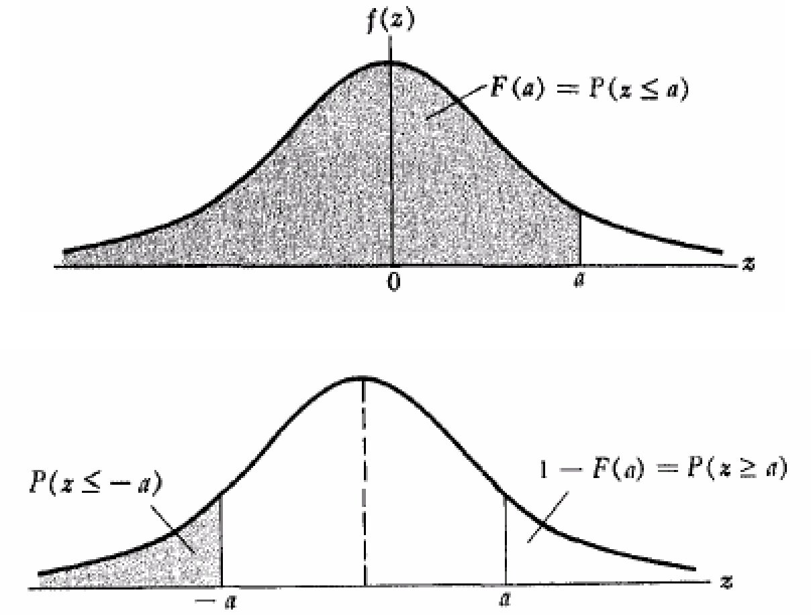

    - Rule #2

            p(Z ≥ a) = 1 - 𝐹(a)    when a is positive
                     = 𝐹(-a)       when a is negative

        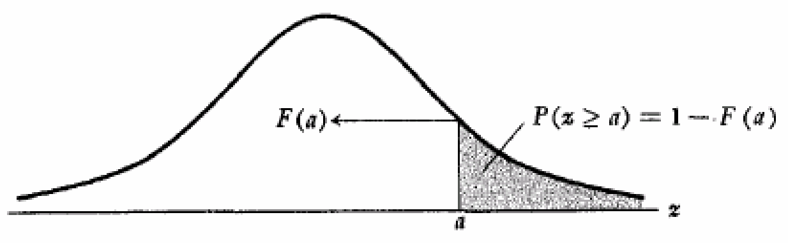

    - Rule #3

            p(a ≤ Z ≤ b) = 𝐹(b) - 𝐹(a)

        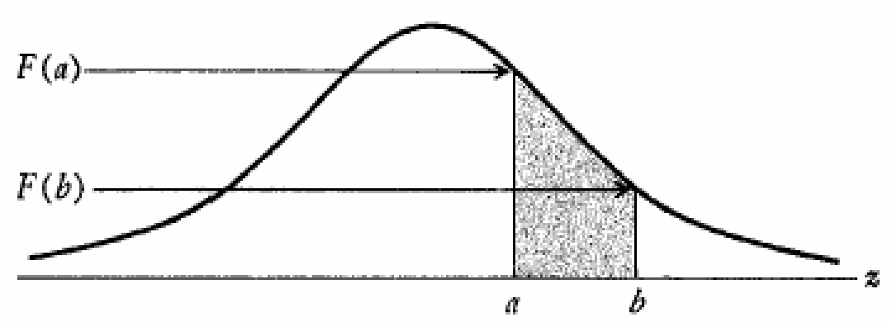

    - Rule #4

            Assume a positive a:
            p(-a ≤ Z ≤ a) = 𝐹(a) - 𝐹(-a)
                          = 𝐹(a) - (1 - 𝐹(a))
                          = 2𝐹(a) - 1

### Examples

Below are some examples of how to use standardized scores to address various questions.

#### Example 1

    The top 5% of applicants (as measured by GRE scores) will receive scholarships.
    If GRE ~ N(500, 100²), what is the GRE score to qualify for a scholarship?

    Solution:
    Let X = GRE, want to find x such that p(X ≥ x) = 0.05
    Let Z = (X - 500) / 100 ~ N(0, 1)
    For p(Z ≥ z) = 0.05, z ≈ 1.65
    x = (z * 100) + 500 = 665

#### Example 2

    Family income ~ N(25000, 10000²).
    If the poverty level is $10,000, what percentage of the population lives in poverty?

    Solution:
    Let X = family income, want to find p(X ≤ 10000).
    Let Z = (X - 25000) / 10000 ~ N(0, 1)
    z = (10000 - 25000) / 10000 = -1.5
    p(Z ≤ -1.5) = 1 - p(Z ≤ 1.5)
                = 1 - 0.9332
                = 0.0668
#### Example 3

    A new tax law is expected to benefit “middle income” families, those with incomes between
    $20,000 and $30,000. If Family income ~ N(25000, 10000²), what percentage of the population
    will benefit from the law?

    Solution:
    Let X = family income, want to find p(20000 ≤ X ≤ 30000)
    Let Z = (X - 25000) / 10000 ~ N(0, 1)
    z₀ = (20000 - 25000) / 10000 = -0.5
    z₁ = (30000 - 25000) / 10000 = 0.5
    p(20000 ≤ X ≤ 30000) = p(-0.5 ≤ Z ≤ 0.5)
                         = 2𝐹(0.5) - 1
                         = 1.383 - 1
                         = 0.383

### Approximating the Binomial Distribution

<mark hl>For a large enough N, a binomial variable X is approximately ~N(Np, Npq)</mark>.
The normal distribution can be used to approximate the binomial distribution.
- How large N needs to be depends on how close p is to 0.5.
    - Fairly good results are usually obtained when Np(1-p) ≥ 3.
- Binomial is discrete: p(X ≤ a) + p(X ≥ a +1) = 1 when a ≤ X ≤ a + 1 is missed from the continuous space.
    - Use continuity correction for approximation
        - p(X ≤ a + 0.5) for p(X ≤ a)
        - p(X ≥ a + 0.5) for p(X ≥ a + 1)

#### Why?

Based on **Central Limit Theorem**, each Bernoulli event can be seen as a random variable with p probability of success and (1 - p) probability of failure.
Then their mean X̄ = (X₁ + X₂ + ... + Xₙ) / n is normally distributed with E(X̄) = μ and V(X̄) = σ² / n.
Note the binomial variable X is X̄*n, which is also normally distributed with E(X) = nμ = np and V(X) = σ² = npq.

## Exponential Distributions

Exponential distributions model the probability of the waiting time w until the first event arrives.
As a comparison, the Poisson distribution models the number of times an event happens in a fixed interval of time.

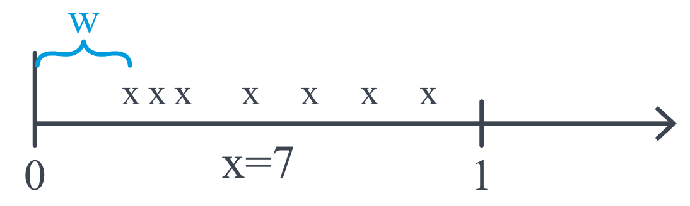

### Properties

- If X is an exponential random variable of the waiting time, then the probability density function (PDF) is:

    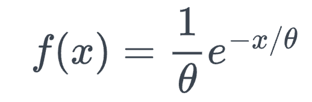

    Alternatively, PDF can also be represented by Poisson parameter λ.

    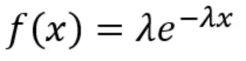

    - λ represents the mean number of events per unit interval in a Poisson distribution.
    - θ represents the mean interval between events in an exponential distribution.
        - θ > 0
        - θ = 1 / λ
    - x ≥ 0

- Curves with changeing λ.

    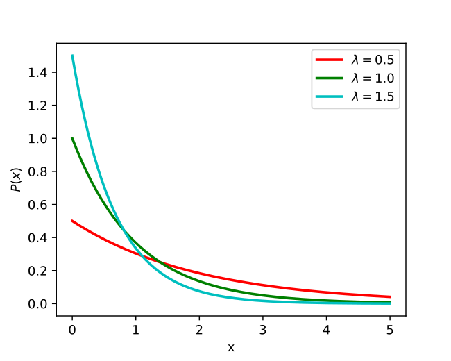

- Mean and variance of an exponential random variable are θ and θ².

- Exponential distribution PDF can be derived from the Poisson distribution.

    𝐹(x) = p(X ≤ x)
         = 1 - p(X > x)
         = 1 - p(no events in [0, x] interval)
         = 1 - Poisson(X = 0, λw)
         = 1 - e^(-λw) * λ⁰ / 0!
         = 1 - e^(-λw)
         = 1 - e^(-x/θ)
    𝑓(x) = 𝐹'(x) = -e^(-x/θ) * (-1/θ)
                 = 1/θ * e^(-x/θ)

### Examples

#### Example 1

    Students arrive at a restaurant according to an approximate Poisson process at a mean rate
    of 30 students per hour. What is the probability that the bouncer has to wait more than
    3 minutes to card the next student?

    Solution:
    θ = 2 mins
    𝐹(X > 3) = 1 - 𝐹(X ≤ 3)
             = 1 - (1 - e^(-3/2)
             ≈ 0.223

#### Example 2

    The number of miles that a car can run before its battery wears out is exponentially
    distributed with an average of 10,000 miles. The owner of the car needs to take a
    5000-mile trip. What is the probability that he will be able to complete the trip without
    having to replace the car battery?

    Solution:
    Let X denote the number of miles that the car can run before its battery wears out.
    X is exponentially distributed with θ = 10000 miles
    𝐹(X > 5000) = 1 - 𝐹(X ≤ 5000)
                = 1 - (1 - e^(-5000/10000)
                ≈ 0.604

## Gamma Distributions

Gamma distributions model the probability of the waiting time w until the 𝛼ᵗʰ event arrives given mean waiting.

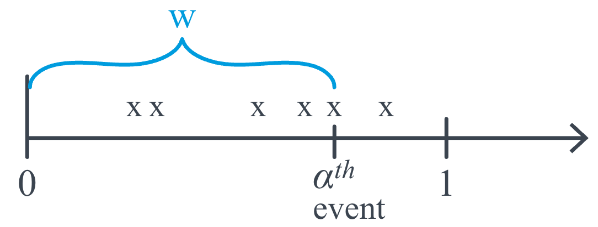

### Properties

- If X is a gamma random variable of the waiting time, then the probability density function (PDF) is:

    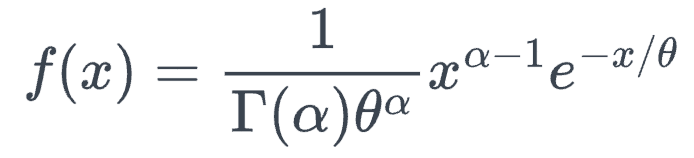

    Alternatively, PDF can also be represented by Poisson parameter λ.

    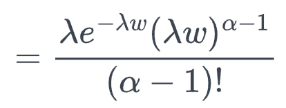

    - λ represents the mean number of events per unit interval in a Poisson distribution.
    - θ represents the mean interval between events in an exponential distribution.
        - θ > 0
        - θ = 1 / λ
    - x > 0
    - Γ(𝛼) = (𝛼 - 1)! is the gamma function
        - 𝛼 > 0

- Gamma function:

    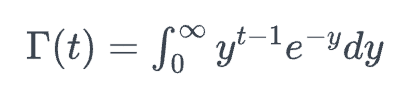

        Γ(t) = (t - 1) * Γ(t-1)  given t > 1.
        Γ(n) = (n - 1)!          if t = n, a positive integer.

- Curves with changing θ and 𝛼.

    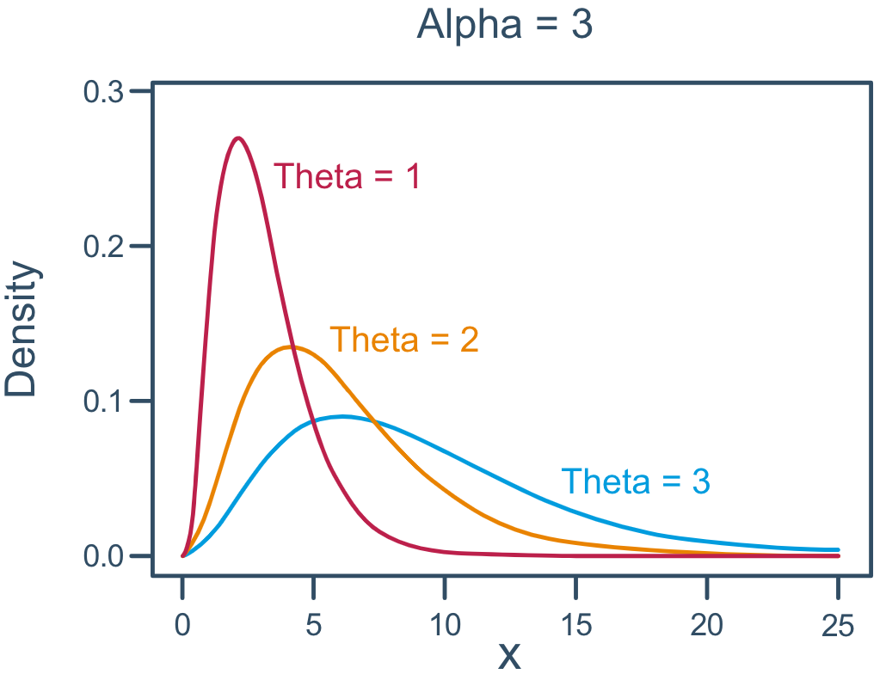

    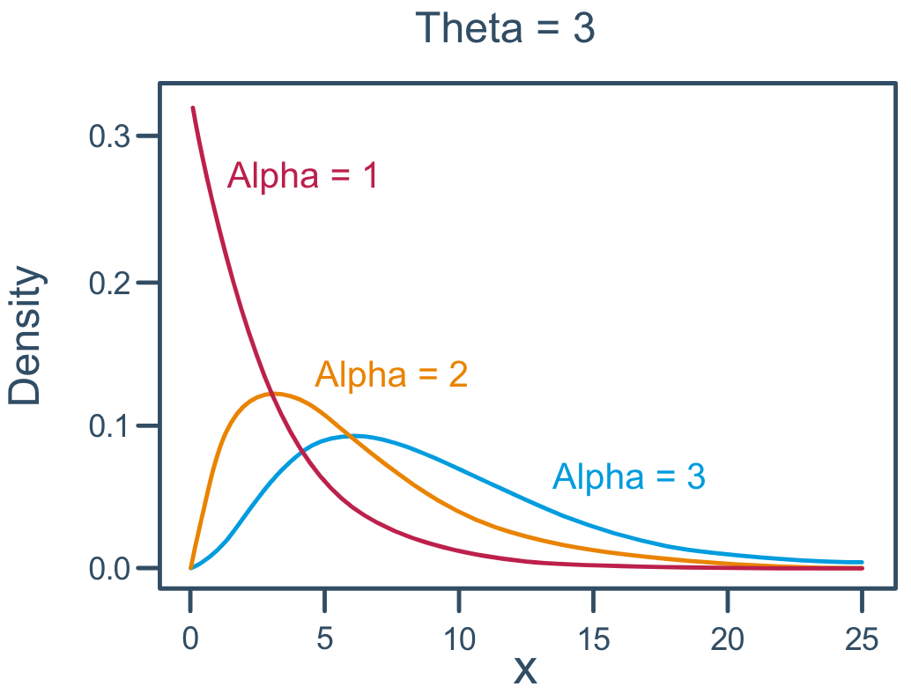

- Mean and variance of a gamma random variable are 𝛼θ and 𝛼θ².

### Example

    Engineers designing the next generation of space shuttles plan to include two fuel pumps
    one active, the other in reserve. If the primary pump malfunctions, the second is
    automatically brought on line. Suppose a typical mission is expected to require that fuel
    be pumped for at most 50 hours. According to the manufacturer's specifications, pumps are
    expected to fail once every 100 hours. What are the chances that such a fuel pump system
    would not remain functioning for the full 50 hours?

    Solution:
    Let X denote the waiting time until 𝛼 = 2nd pump breaks down.
    X is gamma distributed with θ = 100 hours
    𝑓(x) = 1/10000 * x * e^(-x/100)
    p(X < 50) = ∫𝑓(x)𝑑x for 0 < x < 50

## Chi-Square Distributions

The Chi-Square distribution is used in various statistical tests, such as the **Chi-Square goodness-of-fit** test, which evaluates whether an observed frequency distribution fits an expected theoretical distribution, and the **Chi-Square test for independence**, which checks the association between categorical variables in a contingency table.

### Properties

- The chi-square distribution is just a special case of the gamma distribution!
Let X follow a gamma distribution with **𝛼 = r/2 and θ = 2**, then its the probability density function (PDF) is:

    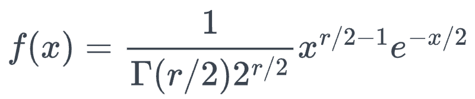

    - r is a positive integer.
    - X follows a chi-square distribution with r degrees of freedom, denoted 𝒳²\(r\), read "chi-square-r."

- Curves with changing r (degrees of freedom).

    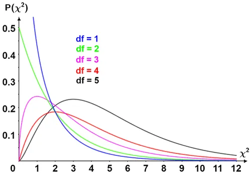

    - Curve is not symmetric and all values are positive.
    - The shape depends on the degrees of freedom.

- Mean and variance of a chi-square random variable with r degrees of freedom are r and 2r.

- Relationship with **standard** normal distribution:

        Suppose the X₁, X₂, ... Xₙ random variables of standard normal distribution, then:

            X₁² + X₂² + ... + Xₙ² ~ 𝒳²(n)

        That is: sum of the squares of n independent standard normal random variables follows
        the Chi-Square distribution with n degrees of freedom.
