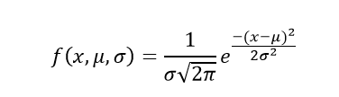

<!---
nav:
    - Home=/
    - Statistics=/trading/statistics/note.md
left_pane: toc
--->

# 4 Distributions

## Normal Distribution

Characteristics of the normal distribution:

- Symmetric, bell shaped.
It describes data that clusters around a mean with symmetric spread.
- Continuous for all values of X between -∞ and ∞ so that each conceivable interval of real numbers has a probability other than zero.
- -∞ ≤ X ≤ ∞
- Two parameters, µ and σ. Note that the normal distribution is actually a family of
distributions, since µ and σ determine the shape of the distribution.
    - Mean (μ): controls the center
    - Standard deviation (σ): controls the spread




- The notation N(µ, σ²) means normally distributed with mean µ and variance σ².
If we say X ∼ N(µ, σ²), we mean that X is distributed N(µ, σ²).
- About 2/3 of cases fall within 1 standard deviation of the mean, that is:
    ```
P(µ - σ ≤ X ≤ µ + σ) = 0.6826
    ```

- About 95% of cases fall within 2 standard deviations of the mean, that is
    ```
P(µ - 2σ ≤ X ≤ µ + 2σ) = 0.9544
    ```


- Many things actually are normally distributed, or very close to it.
For example, height and intelligence are approximately normally distributed; measurement errors also often have a normal distribution.
- The normal distribution is easy to work with mathematically.
In many practical cases, the methods developed using normal theory work quite well even when the distribution is not normal.
- There is a very strong connection between the size of a sample N and the extent to which a sampling distribution approaches the normal form.
Many sampling distributions based on large N can be approximated by the normal distribution even though the population distribution itself is definitely not normal.


Examples:

- Heights of people
- Daily returns of large-cap stocks (often modeled as normal for simplicity)

Usage in time series:

- Assumption for returns: many models (ARIMA, Kalman filter, etc.) assume residuals/errors are normally distributed.
Even though crypto returns are not perfectly normal, log returns of large assets often approximate normal over short periods.
- Confidence intervals: if residuals are normal, we can compute forecast intervals: mean ± 1.96 x σ for 95% CI.
- Risk models: value-at-Risk (VaR) often assumes normal returns (or uses a fat-tailed correction).


### Binomial Distribution

The binomial distribution models the number of successes in a fixed number of independent yes/no (Bernoulli) trials.

Parameters:
- n: number of trials
- p: probability of success in each trial

Formula:
```
P(k successes in n trials) = C(n, k) * p^k * (1-p)^(n-k)
```

Examples:
- Number of times a coin lands heads in 10 flips
- Number of profitable trades in a batch of 100 trades


## 3. Poisson Distribution

What is it: The Poisson distribution models the number of times an event happens in a fixed interval of time or space when events occur independently at a constant average rate.

Parameter:
- lambda (λ): average rate of events per interval

Formula:
```
P(k events) = (λ^k * e^-λ) / k!
```

Examples:
- Number of trades per second on an exchange
- Number of server requests per minute

---

## 4. Uniform Distribution

What is it: The uniform distribution models a situation where all outcomes are equally likely.

Types:
- Discrete uniform: a finite number of equally likely outcomes
- Continuous uniform: all values in an interval [a, b] are equally likely

Formula (continuous):
```
f(x) = 1 / (b - a) for a <= x <= b
```

Examples:
- Random number generator between 0 and 1
- Picking a random time of day

---

## Summary

| Distribution | Typical Use Case |
|--------------|------------------|
| Normal       | Modeling natural phenomena, returns (approximate) |
| Binomial     | Number of successes in fixed trials |
| Poisson      | Number of events in a fixed interval |
| Uniform      | Equally likely outcomes |

---

