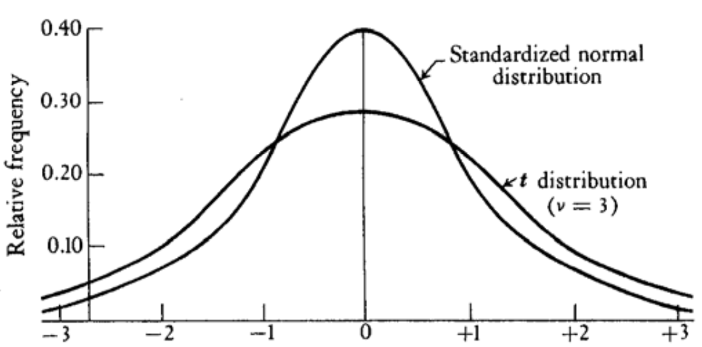
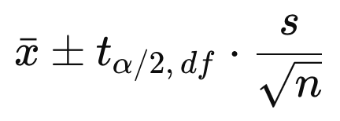

<!---
nav:
    - Home=/
    - Statistics=/trading/statistics/note.md
left_pane: toc
--->

# 5 Sampling

In reality, the entire population data is not available.
One must rely on observing a subset (sample) of the population to estimate population parameters.

## Estimation

- [Estimators](1_definitions.md#key-concepts): as mentioned before, estimators are random variables for estimating population parameters.
- Estimates: specific values of the guessed population parameters.
- Properties of a good estimator:
    - Unbiased: expected value is the true value of the parameter, i.e. E(θ̂) = θ (θ = population parameter, θ̂ = parameter estimator).
    - Efficiency: the most efficient estimator has the smallest variance.
    - Consistency: an estimator is said to be consistent if it yields estimates that converge in probability to the population parameter being estimated as N becomes larger.
- When samples does not represent the population, we get errors:
    - Nonsampling errors: studies the wrong population (e.g. exclude a portion of population from the sample). Assuming non-sampling errors are not present.
    - Sampling errors: the unavoidable difference between sample estimates and the population parameters.

## Sample Statistics

<mark hl>When understanding the sampling, it is very important to clearly grasp subtle difference in notations</mark>.

Suppose we want to take a sample of n **independent** observations in order to determine the characteristics of a random variable X:
- n is the sample size, that is the number of observations from X in one sample..
- Big X represents a random variable.
    - Small x represents a sample (may contain multiple observations/values) from X.
    - Small x̄ represents the mean of a particular sample.
- Big Xᵢ represents a random variable whose process is to "observe single value samples" from X.
    - The probability distribution of Xᵢ is identical to X.
    - Small xᵢ represents a single value sample from Xᵢ.
    - Think "taking a sample of n observations from X" as "taking one observation from each Xᵢ"
- Big X̄ represents a random variable of means of those random samples Xᵢ.
    - It is an [estimator](1_definitions.md#key-concepts) of the population mean.
    - Formula notation:

            X̄ = (X₁ + X₂ + ... + Xₙ) / n = μ̂

    - As a comparison, mean of a sample is:

            x̄ = (1/n) * Σxᵢ    where xᵢ is a subset (size of n) of all possible x's

- Similarly for variance:
    - Big S² represents the estimator:

            S² = (1/n-1) * Σ(Xᵢ² - X̄)²
               = (1/(n-1)) * E(Σ(Xᵢ² - 2XᵢX̄ + X̄²))
               = (1/(n-1)) * E(ΣXᵢ² - Σ2Xᵢx̄ + ΣX̄²)
               = (1/(n-1)) * E(ΣXᵢ² - 2nX̄² + nX̄²)
               = (1/n-1) * (ΣXᵢ² - nX̄²)
               = σ̂²

    - Small s² represents a variance of a sample:

            s² = (1/(n-1)) * (Σxᵢ² - nx̄²)    where xᵢ is a subset (size of n) of all possible x's

- As a comparison to X̄ and S², E(X) and V(X) represent for the whole population
    - Sample mean and sample variance only concern values from a sample.
    - E(X) and V(X) are for the whole population.

            E(Xᵢ) = E(X) = μ
            V(Xᵢ) = V(X) = σ²

- Note the ^ used for sample mean μ̂ and variance σ̂².
It is common to use a ^ over a population parameter to represent the corresponding sample estimate.

## Sample Distributions

Obviously, taking different samples yeilds different x̄.
Therefore X̄ is itself a random variable, which has its own mean and variance:

    E(X̄) = E((X₁ + X₂ + ... + Xₙ) / n)
         = (E(X₁) + E(X₂) + ... + E(Xₙ)) / n
         = μ

    V(X̄) = V((X₁ + X₂ + ... + Xₙ) / n)
         = V(X₁ + X₂ + ... + Xₙ) / n²
         = (V(X₁) + V(X₂) + ... + V(Xₙ)) / n²     [Xᵢ are independent, check rule#15]
         = σ² / n

    StdDev(X̄) = σ / sqrt(n)    also known as the true standard error of the mean

### Central Limit Theorem

The central limit theorem (CLT) is one of the most important results in probability theory.
It states that, under certain conditions, the sum of a large number of random variables is approximately normally distributed.

    Suppose the X₁, X₂, ... Xₙ random variables that are independent and identically distributed
    (iid) with expected mean and variance E(Xᵢ) = μ  and V(Xᵢ) = σ².

    Then the random variable sample mean X̄ = (X₁ + X₂ + ... + Xₙ) / n is normally distributed with
    E(X̄) = μ and V(X̄) = σ² / n.

    Note the original random variables X₁ are not necessarily normally distributed.

### Why Does Sample Mean Variance V(X̄) Have Denominator n?

Intuitively, as more sample size increases (i.e. more observations from one sample), the sample mean would get closer to the true mean.
As a result the sample means are getting closer.
Their variance becomes smaller (as n becomes larger).

### Why Does Sample Variance S² Have n - 1 in the Denominator?

The reason we use n-1 rather than n is so that the sample variance will be an [unbiased estimator](1_definitions.md#key-concepts) of the population variance σ².
That is:

    The sample variance is the formula for a particular sample:
        s² = (1/(n-1)) * (Σxᵢ² - nx̄²)
    Now we define an estimator S² for s² by replacing variables by estimators:
        S² = (1/(n-1)) * (ΣXᵢ² - nX̄²)
    Xᵢ is an unbiased estimator for population X, thus xᵢ.
    X̄  is an unbiased estimator for mean of population X, thus x̄.

    Now need to prove S² is an unbiased estimator of the population variance σ², i.e. E(S²) = σ²

    Proof:
    (1) From population variance definition σ² = E(X²) - μ², we have E(X²) = σ² + μ²
    (2) E(Xᵢ²) = E(X²) = σ² + μ²
    (3) E(X̄²) = V(X̄) + E(X̄)²
              = σ² / n + μ²

    then:
    E(S²) = E((1/(n-1)) * (ΣXᵢ² - nX̄²))
          = (1/(n-1)) * E(ΣXᵢ² - nX̄²)
          = (1/(n-1)) * (ΣE(Xᵢ²) - nE(X̄²))
          = (1/(n-1)) * (n(σ² + μ²) - n(σ² / n + μ²))
          = σ²

### Shape of X̄

If X ~ N(μ, σ²) , then:

    X̄ ~ N(μ, σ²/n)

    Z = (X̄ - μ) / (σ / sqrt(n)) ~ N(0, 1)

**What if X is not normally distributed?**

<mark hl>According to the **Central Limit Theorem**, regardless of the shape of the parent population, the distribution of X̄ approaches N(μ, σ²/n) if:</mark>
- <mark>As long as X has a finite mean μ and variance σ²</mark>
- <mark>Sample size n approaches infinity</mark>
- <mark>In practice, 30 is usually a pretty good approximation of infinity</mark>

## The T Distribution

The Z transformation above requires μ and σ are known.
In reality, much more common situation is where both are unknown.
If we use sample variance s to replace σ, then it becomes a T transformation, that produces a variable with a T distribution:

    T = (X̄ - μ) / (s / sqrt(n)) ~ Tₙ₋₁

    σ / sqrt(n) true standard error of the mean
    s / sqrt(n) estimated standard error of the mean

Properties:
- Shape is determined by parameter degrees of freedom: df = n -1
- E(T) = 0
- The T distribution is symmetric
- As n approaches infinity, T ~ N(0, 1). 120 is a pretty good approximation of infinity while 30 is not too bad.

    

- The T transformation is appropriate whenever the parent population is normally distributed and σ is unknown.
Even if the parent population is not normally distributed, T will often work ok.
    - Note: X̄ approaches normally distribution according to **Central Limit Theorem**.

## Confidence Intervals

Population parameter estimates from samples are not identical to population parameter due to sampling error.
Because of the estimate inaccuracy, we need to specify a range of values in which the population parameter is likely to be.
This is when the T distribution comes in handy as normal distribution cannot be used  because population variance σ is unknown.

Definition:

    α = the probability the population parameter is outside of the confidence interval
    1 - α = the probability the population parameter is inside the confidence interval

    The 100(1 - α)% confidence interval will include the true value of the population parameter
    with probability 1 - α.

    Example: α = 0.05
    (1) 95% of the time, the 95% confidence interval will include the true population parameter.
    (2) 2.5% of the time, the true population parameter is larger than the 95% confidence
        interval upper limit.
    (3) 2.5% of the time, the true population parameter is smaller than the 95% confidence
        interval lower limit.

Based on the T transformation, we have the formula for confidence interval:

- α is the significance level
- s is the sample variance
- n is the sample size
- t𝛼/₂,df is the **critical value**, t-value from t-distribution with 𝛼 and df = n - 1
