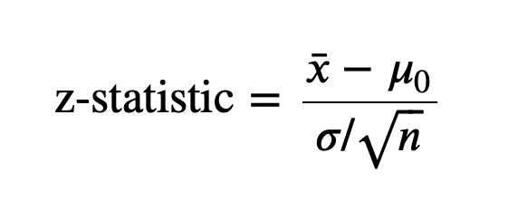
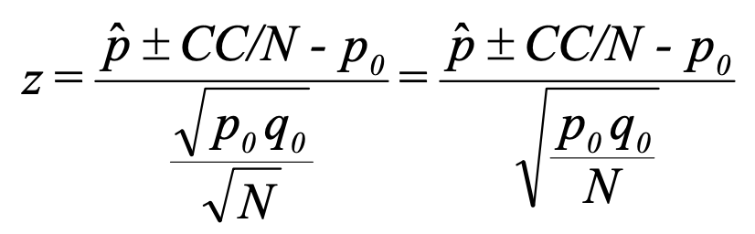
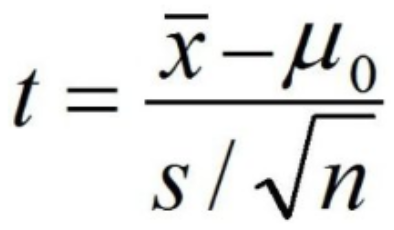
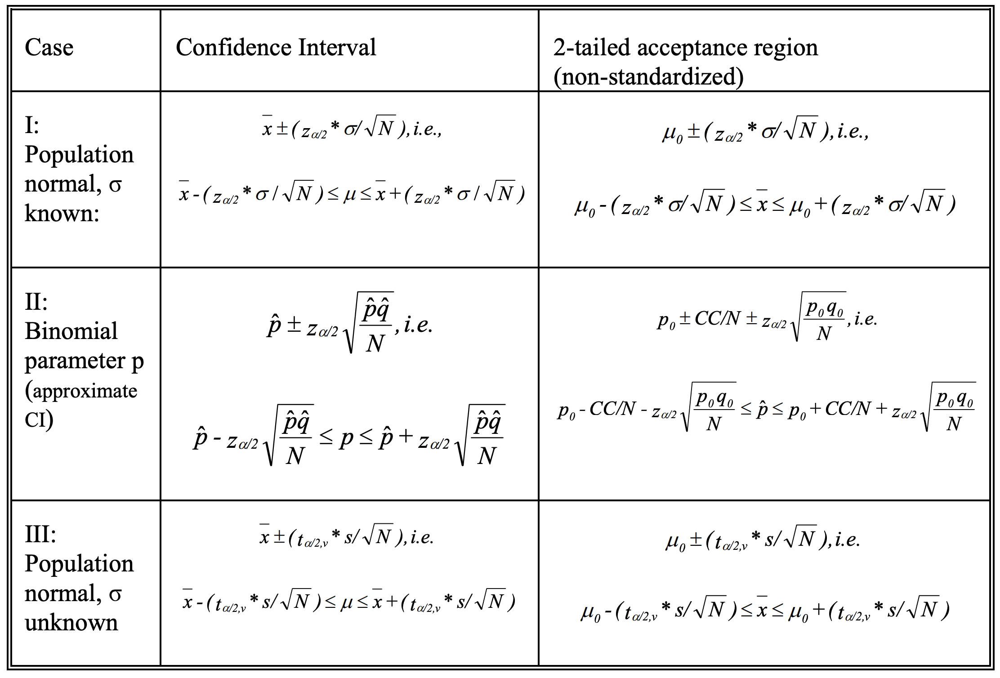

<!---
nav:
    - Home=/
    - Statistics=/trading/statistics/note.md
left_pane: toc
--->

# 6 Hypothesis Testing

## Concepts

- Population parameters are unknown.
But we can make hypotheses about their true values.
- The purpose of hypothesis testing is to choose between 2 competing hypotheses about the value of a population parameter.
    - One hypothesis claims wages of men and women are equal.
    - An alternative claims men make more than women.
- Null hypothesis: the hypothesis actually to be tested, denoted as H₀.
    - Null hypothesis is assumed to be true unless there is a strong evidence to the contrary.
- Alternative hypothesis: the other hypothesis assumed to be true when null hypothesis is false, denoted as H₁ or HA
- Convenient to have null hypothesis contain an equal sign, e.g. H₀: µ = 100, H₁: µ > 100.
- The true value of the population parameter should be in either H₀ or H₁.
    - One-sided test: if true value lies entirely above or below the value specified in H₀.
    - two-sided test: if true value can lie on either side of the value specified in H₀.

## The Testing

- The standard procedure is to assume H₀ is true, and try to determine whether there is sufficient evidence to declare H₀ false.
- Reject H₀ only when chance is small that H₀ is true.
    - Type I error: reject the null hypothesis when the null is true.
The probability of Type I error = 𝛼.

            α = Probability of Type I error = p(rejecting H₀ | H₀ is true)

    - Type II error: accept the null hypothesis when it is not true.
The probability of Type II error = β.

            β = Probability of Type II error = p(accepting H₀ | H₀ is false)

    - α and β are not independent of each other.
Increasing sample size n cause both to decrease.
- Testing procedure:
    - Define H₀ and H₁
    - Determine the appropriate test statistic.
A test statistic is a random variable used to determine how close a specific sample result falls to one of the hypotheses being tested.
    - Determine the critical region that statisfies required α.
Reject the null hypothesis if the computed test statistic is in the critical region.
The opposite of critical region is the acceptance region.

Typically, α is set to 0.05 or 0.01.
If α = 0.05, it would erroneously reject H₀ when H₀ is true 5% of the time.

## Test Statistics

So far, we have covered steps for hypothesis testing.
Here summarizes the test statistic for different cases.

### Z Test Statistic

#### Normal Distribution

Z-statistic can be used to test normal distribution's parameter μ:
- X is a random variable of normal distribution with known variance σ² and unknown mean μ.
    -  Other types can use normal distribution to approximate with conditions.
    - <mark hl>For example, even X is not normally distributed, its sample mean X̄ is normally distributed with large sample size n</mark>.
- The null hypothesis is H₀: E(X) = μ₀

    

Note:
- x̄ is the sampled mean.
- μ₀ is the population mean.
- Z ~ N(0, 1).
- The denominator in the z-statistic is σ / sqrt(n) while the z-score's denominator is σ.
The reason is z-score is dealing with population variance, which is σ².
Here the z-statistic is using sample variance as denominator, which is σ²/n.

#### Binomial Distribution

Z-statistic can be used to test binomial distribution's parameter p:
- X is random variable of binomial distribution with unknown success rate p.
- According to the [properties of sample variable](5_sampling.md#sample-distributions),

        E(X̄) = μ = p
        V(X̄) = σ² / n = pq
        Where u = p and σ² = npq are mean and variance of the binomial distribution sampled.

- Based on **Central Limit Theorem**,  X̄ ~ N(μ, σ²/n) = N(μ, pq/n) for large n.
- The null hypothesis is H₀: p = p₀

    

Note:
- CC represents the correction for continuity because X is a discrete random variable.
Add 0.5/N if 𝗉̂ < p₀.
Substract 0.5/N if 𝗉̂ > p₀.
Do nothing if 𝗉̂ = p₀.
- 𝗉̂ is the sampled success rate.
- q₀ = 1 - p₀.
- Z ~ N(0, 1).
- The formula is the same as the normal distribution case, except both numerator and denominator are scaled by N.

### T Test Statistic

Z-statistic does not work when variance σ² is unknown.
Instead, T-statistic can be used to test normal distribution's parameter u:
- X is a random variable of normal distribution with unknown variance σ² and mean μ.
- Use sampled variance s² to replace population variance σ².
- The null hypothesis is H₀: E(X) = μ₀

    

Note:
- x̄ is the sampled mean.
- T ~ t-distribution with 𝛼 and degree of freedoms n - 1
Note the only difference between Z-statistic and T-statistic is using the true variance σ vs. the sample variance s.

### Hypothesis Testing Using Confidence Intervals

Confidence intervals use T-transformation to estimate population mean interval from sample mean and variance with 100(1 - α)% probability.
This is essentially the same as the T-statistic:
- Null hypothesis H₀: E(X) = μ₀, alternative two-tailed hypothesis H₁: E(X) <> μ₀.
- H₀ will not be rejected at α level of significant if μ₀ falls within the 100(1 - α)% confidence interval.
- H₀ will be rejected at α level of significant if μ₀ does not fall within the 100(1 - α)% confidence interval.
- The use of either confidence intervals or acceptance regions should lead to the same conclusion when testing a two-tailed alternative.
    - With an acceptance region, you start with a hypothesized value for µ0, and then determine whether sample values fall within that range if µ0 is correct.
    - With a confidence interval, you first compute the sample mean, and then determine the estimated range for µ based on sample values.
If µ0 falls within this range, you accept the null hypothesis.

## Examples

### Example 1 (One-Sided Z-Statistic with One Sample)

    One researcher believes a coin is “fair,” the other believes the coin is biased toward heads.
    The coin is tossed 20 times, yielding 15 heads. Indicate whether or not the first researcher’s
    position is supported by the results. Use α = .05.

    Solution:
    If the coin is fair, p = 0.5.
    When n is large, we can use X ~ N(np, npq) = N(10, 5)
    (1) Define hypotheses:
        H₀: E(X) = 10 heads
        H₁: E(X) > 10 heads
    (2) Use Z = (number of heads ± 0.5 - 10) / sqrt(5/20) as the test statistic.
    (3) Acceptance region is p(Z ≤ z) = 0.95 = 1 - α.
        So z = 1.65
        Reject H₀ if z > 1.65
    (4) z = (15 - 0.5 - 10) / 0.5 = 2.01. H₀ is rejected.

    Note: ± 0.5 in step 2 is a correction for continuity since X is not continuous.
    To do this, add 0.5 to x when x < Np, and subtract 0.5 from x when x > Np.

### Example 2 (Two-Sided Z-Statistic with One Sample)

    Design a decision rule to test the hypothesis that a coin is fair if a sample of 64 tosses of
    the coin is taken with a level of significance of 0.05.

    Solution:
    If the coin is fair, p = 0.5.
    When n is large, we can use X ~ N(np, npq) = N(32, 16)
    (1) Define hypotheses:
        H₀: E(X) = 32 heads
        H₁: E(X) <> 32 heads
    (2) Use Z = (number of heads ± 0.5 - 32) / sqrt(16) as the test statistic.
    (3) Acceptance region is p(-z ≤ Z ≤ z) = 0.95 = 1 - α.
        So z = 1.96
        Reject H₀ if z < 1.96 or z > 1.96

<mark hl>Note how the examples above use the Z-statistic without the sqrt(n) in denominator.</mark>
When converting the original n Bernoulli trials into a binomial distribution, all tosses are combined to become one binomial observation of x successes.
Therefore, sqrt(1) is ignored and the used formula is still a Z-statistic.

### Example 3 (Z-Statistic with Multiple Samples)

    A manufacture of steel rods considers that the manufacturing process is working properly if
    the mean length of the rods is 8.6. The standard deviation of these rods always runs about
    0.3 inches. Suppose a random sample of size n = 36 yields an average length of 8.7 inches.
    Should the manufacturer conclude the process is working properly or improperly?

    Solution:
    Sample size n is large enough to consider X̄ as a normal distribution.
    Since population μ and σ² are known, Z-statistic can be used.
    (1) Define hypotheses:
        H₀: E(X) = μ₀ = 8.6
        H₁: E(X) <> 8.6
    (2) Use Z = (X̄ - μ₀) / (σ / sqrt(n)) ~ N(0, 1) as the test statistic
    (3) Acceptance region is p(-z ≤ Z ≤ z) = 0.95 = 1 - 2 * α.
        So z = 1.96
        Reject H₀ if z < 1.96 or z > 1.96
    (4) z = (8.7 - 8.6) / (0.3 / sqrt(36)) = 2
        The null hypothesis H₀ should be rejected with level of significance 0.05.

### Example 4 (T-Statistic)

    A Bowler claims that she has a 215 average. In her latest performance, she scores 188,
    214, and 204. Would you conclude the bowler is “off her game?”

    Solution:
    Sample size n = 3.
    Population variance is unknown. So T-statisic can be used.
    x̄ = (188 + 214 + 204) / 3 = 202
    s² = ((188 - 202)² + (214 -202)² + (204 - 202)²) / (3 - 1)
       = 172
    (1) Define hypotheses:
        H₀: E(X) = μ₀ = 215
        H₁: E(X) <> 215
    (2) Use T = (X̄ - μ₀) / (s / sqrt(n)) ~ t-distribution with α and degree of freedoms 2.
    (3) Critical region is p(-t ≤ T ≤ t) = 0.05 = α.
        So t = 4.303
        Reject H₀ if t < -4.303 or t > 4.303
    (4) t = (202 - 215) / sqrt(172 / 3) = -1.717
        The null hypothesis H₀ cannot be rejected with level of significance 0.05.
