<!---
nav:
    - Home=/
    - Statistics=/trading/statistics/note.md
left_pane: toc
--->

# 7 Two Sample Hypothesis Testing

Chapter 6 focuses on one-sample tests.
It is often interested in comparing two or more groups, i.e. testing hypotheses about µ₁ and µ₂.
- Null hypothesis H₀: µ₁ - µ₂ = 0 or µ₁ = µ₂
- Alternative hypothesis H₁:
    - µ₁ - µ₂ ≠ 0
    - µ₁ - µ₂ > 0
    - µ₁ - µ₂ < 0

Examples:
- Do women have lower wages than men?
- Do smokers have higher cancer rates than non-smokers?
- Do students in Catholic shcools learn more than students in public schools?

To test a hypothesis, take independent samples from both populations, and estimate µ₁ - µ₂ by μ̂₁ - μ̂₂.

    The 2 samples (from different populations) are independent:
    E(μ̂₁ - μ̂₂) = E(μ̂₁) - E(μ̂₂)
               = µ₁ - µ₂
    V(μ̂₁ - μ̂₂) = V(μ̂₁) + V(μ̂₂)
               = σ₁²/N₁ - σ₂²/N₂
    True S.E.(μ̂₁ - μ̂₂) = sqrt(V(μ̂₁ - μ̂₂))
                       = sqrt(σ₁²/N₁ - σ₂²/N₂)

To generalize, assume θ is the target parameter (e.g. θ = µ₁ - µ₂).
θ₀ is the value predicted by the null hypothesis.
θ̂ is the observed value from samples.
σ is the true standard error and σ̂ is the estimated standard error.
Then z or t test can be constructed:

    Z = (θ̂ - θ₀) / σ
    T = (θ̂ - θ₀) / σ̂

## Case 1: Variances Are Known

True standard error:

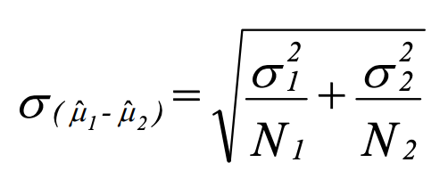

Test statistic (simplification when null hypothesis is µ₁ = µ₂):

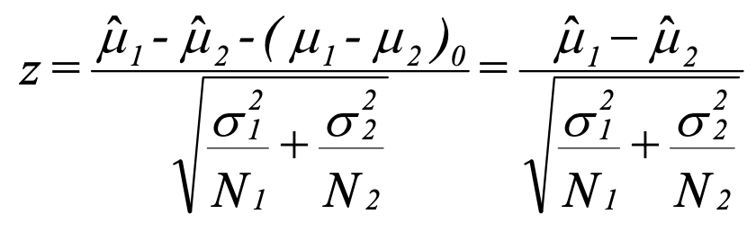

Confidence interval:

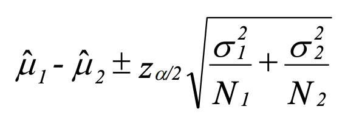

2-tailed acceptance region:

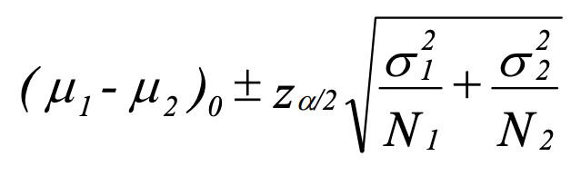

### Example

    Indiana University claims that it has a lower crime rate than Ohio State University. A random
    sample of crime rates for 12 different months is drawn for each school, yielding μ̂₁ = 370 and
    μ̂₂ = 400. It is known that σ₁² = 400 and σ₂² = 800.
    Test Indiana's claim at the 0.02 level of significance.

    Solution:
    H₀: µ₁ - µ₂ = 0
    H₁: µ₁ - µ₂ < 0

    Population variances are known:
        z = (μ̂₁ - μ̂₂) / sqrt(σ₁²/N₁ - σ₂²/N₂)
          = (μ̂₁ - μ̂₂) / sqrt(400/12 + 800/12)
          = (μ̂₁ - μ̂₂) / 10

    The one-sided acceptance region for a negative expected mean at 0.02 level of significance is
    z > -2.05.
    The estimated z is calculated as (370 - 400) / 10 = -3 < -2.05.
    The null hypothesis H₀ is rejected.

## Case 2: Variances Are Unknown But Equal

True standard error (σ₁ = σ₂ = σ):

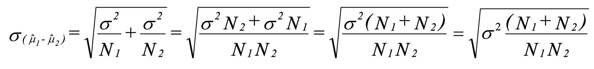

Since variance is unknown, use sample variance to estimate the standard error.
First estimate the sample variance s from s₁ and s₂:

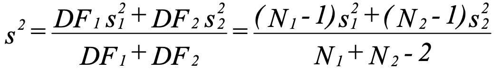

Substituting s² for σ², we get the estimated standard error:

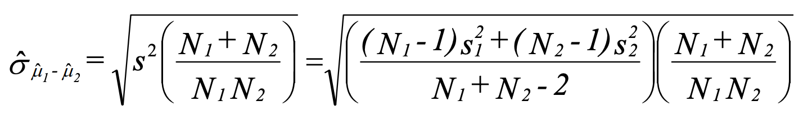

Test statistic:

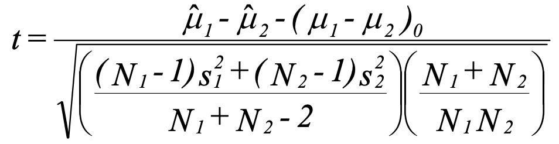

Confidence interval:

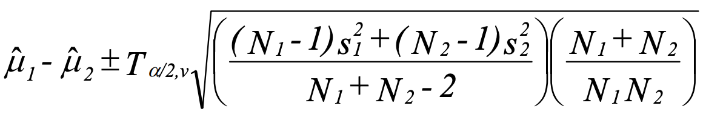

2-tailed acceptance region:

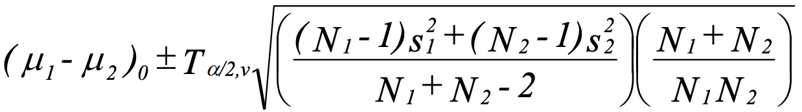

### Example

    A professor believes that women do better on her exams than men do. A sample of 8 women
    (N₁ = 8) and 10 men (N₂ = 10) yields μ̂₁ = 7, μ̂₂ = 5.5, s₁² = 1 and s₂² = 1.7. Using α = 0.01,
    test whether the female mean is greater than the male mean. Assume that σ₁ = σ₂ = σ.

    Solution:
    H₀: µ₁ - µ₂ = 0
    H₁: µ₁ - µ₂ > 0

    Population variances are unknown and equal:
        t = (μ̂₁ - μ̂₂) / 0.56

    Degrees of freedom = N₁ + N₂ - 2 = 16
    The one-sided acceptance region for a positive mean at 0.01 level of significance with
    df = 16 is t < 2.583.
    The estimated t = (7 - 5.5) / 0.56
                    = 2.679 > 2.583
    The null hypothesis H₀ is rejected.

## Case 3: Variances Are Unknown and Unequal

This is the more general and common case.

Estimated standard error:

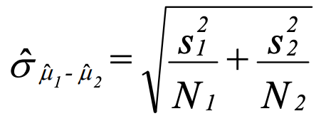

Test statistic:

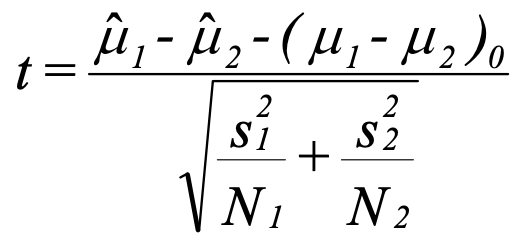

The tricky part is the degrees of freedom.
Below is the Satterthwaite's degrees of freedom.
Note that this does not have to equal an even integer, so round off to the nearest whole number.

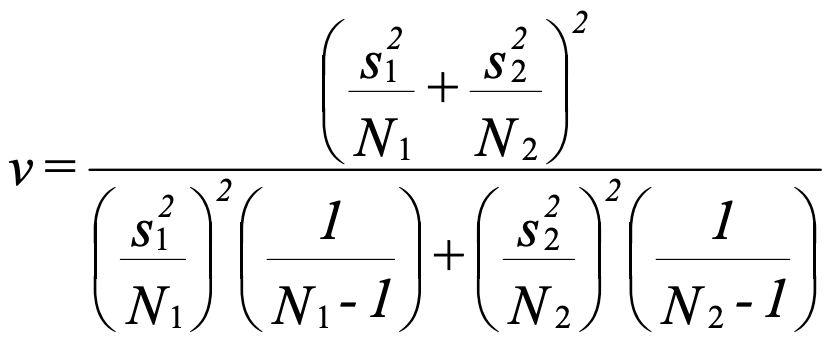

An alternative is Welch's degrees of freedom:

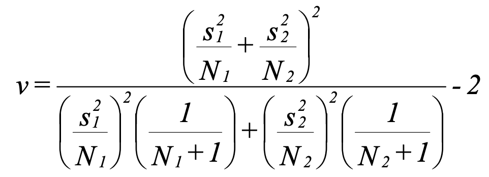

Confidence interval:

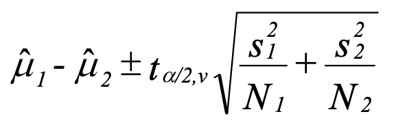

2-tailed acceptance region:

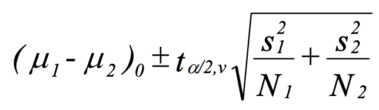

### Example

    Rework the previous professor example without assuming σ₁ = σ₂.

    Solution:
    H₀: µ₁ - µ₂ = 0
    H₁: µ₁ - µ₂ > 0

    Population variances are unknown and not equal:
        t = (μ̂₁ - μ̂₂) / 0.543
    Degrees of freedom = 15.988 ≈ 16
    The one-sided acceptance region for a positive mean at 0.01 level of significance with
    df = 16 is t < 2.583.
    The estimated t = (7 - 5.5) / 0.543
                    = 2.762 > 2.583
    The null hypothesis H₀ is rejected.

## Case 4: Matched Pairs with Unknown Variances

Data are sampled in pairs and are not necessarily independent.
- Comparing scores of husbands and wives, which are likely similar to each other.
- Comparing a person's health before and after receiving some treatment.

Let D = X₁ - X₂ where X₁ and X₂ are the scores of the first and the second member of the pair.
X₁ and X₂ are normally distributed and dependent.

    E(D) = E(X₁ - X₂)
         = E(X₁) - E(X₂)
         = µ₁ - µ₂
    V(D) = V(X₁ - X₂)
         = V(X₁) + V(X₂) - 2Cov(X₁, X₂)
         = σ₁² + σ₂² - 2σ₁₂

Now let D-bar be sample mean of D:

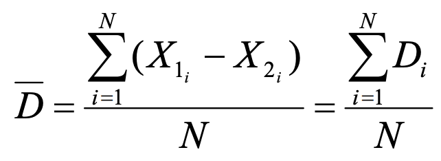

Its mean and variance are:

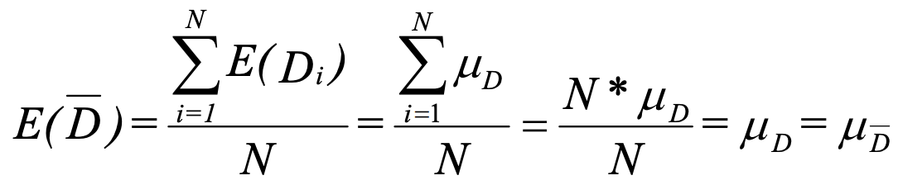

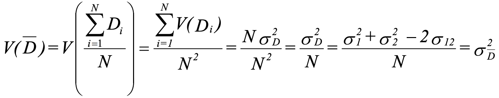

True standard error:

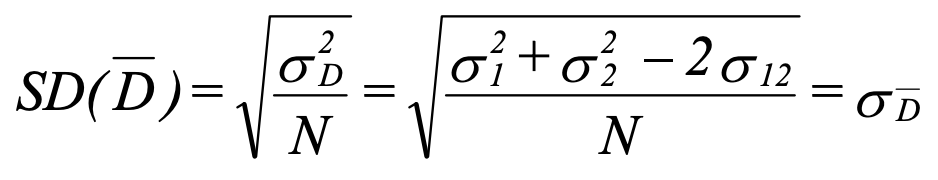

Estimated standard error:

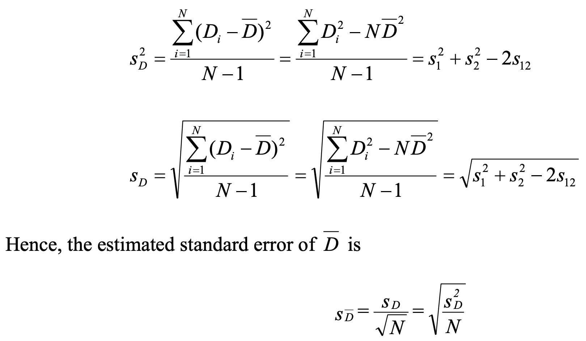

Test statistic:

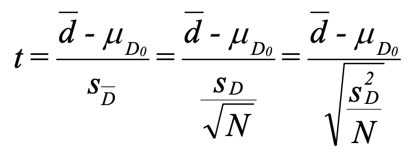

Confidence interval:

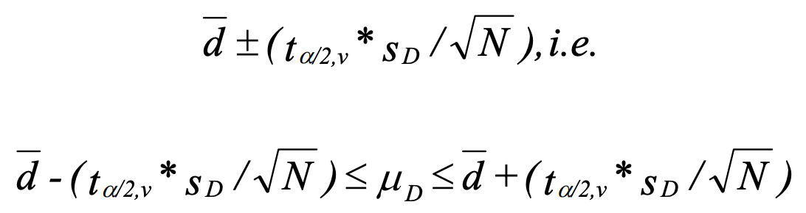

2-tailed acceptance region:

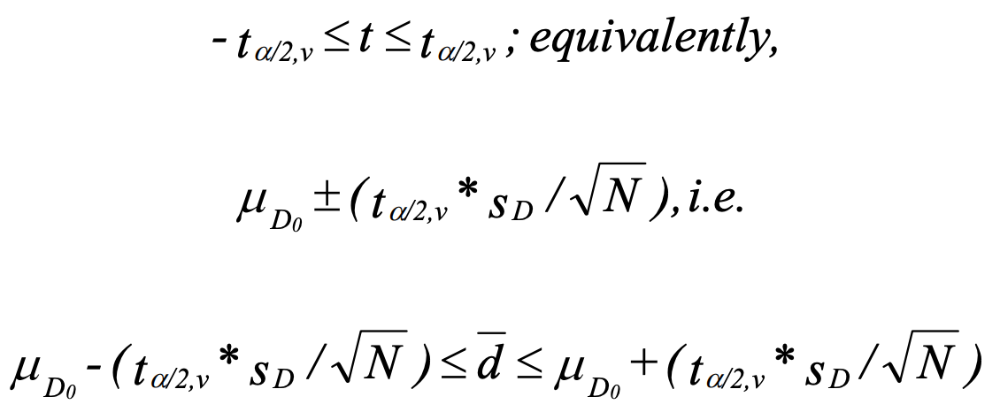

### Example

    A researcher constructed a scale to measure influence on family decision-making, and collected
    the following data from 8 pairs of husbands and wives:

        | Pair# | H score | W score |
        | ----- | ------- | ------- |
        | 1     | 26      | 30      |
        | 2     | 28      | 29      |
        | 3     | 28      | 28      |
        | 4     | 29      | 27      |
        | 5     | 30      | 26      |
        | 6     | 31      | 25      |
        | 7     | 34      | 24      |
        | 8     | 37      | 23      |
        | ----- | ------- | ------- |
        | Sum   | 243     | 212     |

    Test, at the 0.05 level of significance, whether there is any significant difference between
    the average scores of husbands and wives.

    Solution:
    Let D = (husband score - wife score), N = 8
    d_bar = ∑Dᵢ / N
          = 31 / 8
          = 3.875
    Sd² = 369 - 8 * 3.875²
        = 35.554
    Sd = sqrt(35.554) = 5.963

    H₀: E(D) = 0
    H₁: E(D) ≠ 0

    The two-sided acceptance region at 0.05 level of significance with df = 7 is:
        -2.365 < t < 2.365
    The estimated t = 3.875 / 2.1081
                    = 1.838
    It is within the acceptance region, so we cannot reject H₀

## Case 5: Difference Between Two Proportions

We are often interested in comparing how proportions differ between two populations.
For example, we want to compare the proportion of women who smoke with the proportion of men who smoke.

Let p̂ᵢ = Xᵢ / Nᵢ be the proportion of observed successed in group i.
Xᵢ is the number of successes in group i.

When N is large, we can approximate p̂ with normal distribution N(p̂, p̂q̂/N).

Mean and variance:

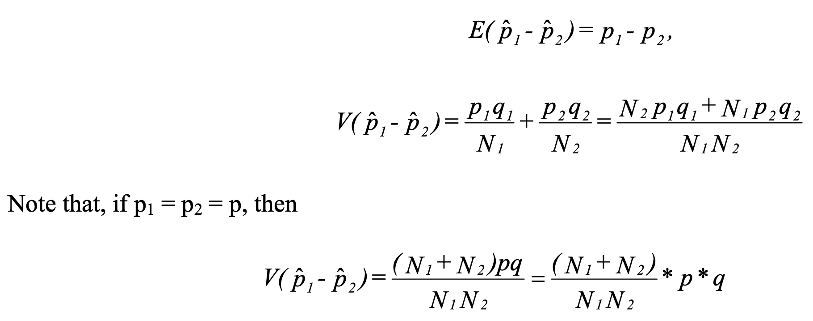

Estimation for p:

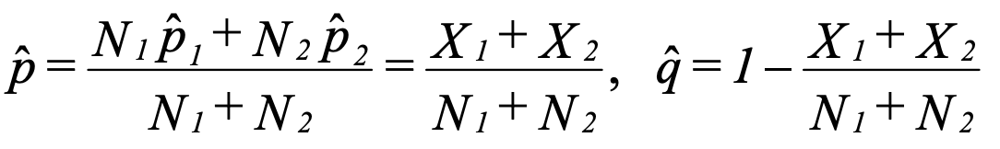

Variance with p substitution:

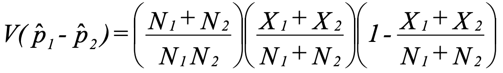

Test statistic for H₀: p₁= p₂

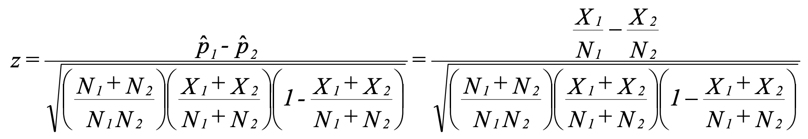

Confidence interval:

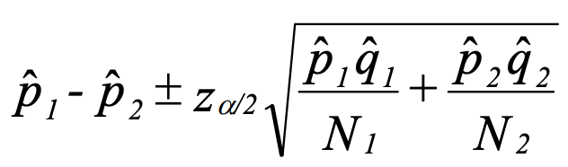

### Example

    Two groups, A and B, each consist of 100 randomly assigned people who have a disease. One
    serum is given to Group A and a different serum is given to Group B; otherwise, the two
    groups are treated identically. It is found that in groups A and B, 75 and 65 people recover
    from the disease respectively.
    Test the hypothesis that the serums differ in their effectiveness using α = 0.05.

    Solution:
    H₀: p₁ - p₂ = 0
    H₁: p₁ - p₂ ≠ 0

    The acceptance region for 0.05 significance of a normal distribution is:
        -1.96 < z < 1.96
    The estimated z = 1.543
    So H₀ cannot be rejected.
