<!---
nav:
    - Home=/
    - Statistics=/trading/statistics/note.md
left_pane: toc
--->

# 8 Analysis of Variance (ANOVA)

Chapter 7 focuses on comparing two-samples.
But more than often, we need to test more than two populations.
For example, we want to compare the average income of blacks, whites, and others.
We want to compare the educational attainment of Catholics, Protestants, Jews, etc.

Pairwise comparison may not work because by chance some contrasts would be significant.
For example, 7 groups need ₇C₂ = 21 combinations, with 𝛼 = 0.05, you can expect one of the contrasts to be significant.
Analysis of Variance (ANOVA) is the tool to solve this sort of problems.

## One-Way Analysis of Variance

ANOVA is appropriate when:
- One dependent, interval level variable
- 2 or more populations, the independent variable is categorical.

The ANOVA test is interested in comparing **J** groups, i.e. testing hypotheses about µ₁, µ₂, µ₃ ... µⱼ.
- Null hypothesis H₀: µ₁ = µ₂ = µ₃ ... = µⱼ
- Alternative hypothesis H₁: the means are not all equal

### Simple One-Factor Model

Assume J populations.
Take j samples, one sample from each population with size Nⱼ.
Each sample score can be decomposed into 3 components:

    yᵢⱼ = µ + 𝜏ⱼ + εᵢⱼ

- µ is the **grand mean** of all populations.
- 𝜏ⱼ is the **treatment effect** associated with the corresponding population j.
It is the deviation of the population mean from the the grand mean.
- εᵢⱼ is the **random error term**, reflecting variability within each population.

An alternative way to write the model is:

    yᵢⱼ = µⱼ + εᵢⱼ    where µⱼ = µ + 𝜏ⱼ

If the null hypothesis is true, µ₁ = µ₂ = µ₃ ... = µⱼ = µ, that means there are no treatment effects.
**It is equivalent to claim the null hypothesis H₀: 𝜏₁ = 𝜏₂ = 𝜏₃ ... = 𝜏ⱼ = 0**

Sample treatment effects can be easily compuated:

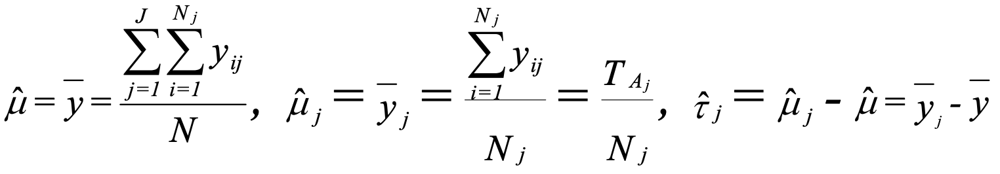

**Now the problem becomes how we can determine if these differences in treatment effects are significant**.

### The Test

Rationale behid the test:
- The basic idea is to determine if variations in the set of samples are due to random error or difference in means of populations.
- Use mean square to represent the variations.
    - Mean square within samples is due to random errors.
    - Mean square between samples is due to differences between population means.
- Calculate the relative value of mean squre between samples to the mean square within samples (by division)
    - This give a measurement of the population mean variation relative to random error.
    - It follows F distribution.

#### Step 1

Given the samples, calculate sum of squares (SS):

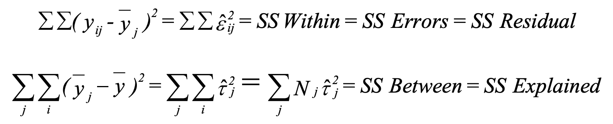

- **SS Within** captures variability within each group.
It is also called SS Errors or SS Residual because it reflects variability that cannot be explained by group membership.
Each sample has (Nⱼ - 1) degrees of freedom, so the **DF Within** is ∑(Nⱼ - 1)) = N - J.
- **SS Between** captures variability between groups.
It is also called SS Explained because it reflects variability that is explained by group membership.
There are J samples and 1 grand mean, so **DF Between** is J - 1

#### Step 2

Divide SS by its degrees of freedom, we get mean square (MS):

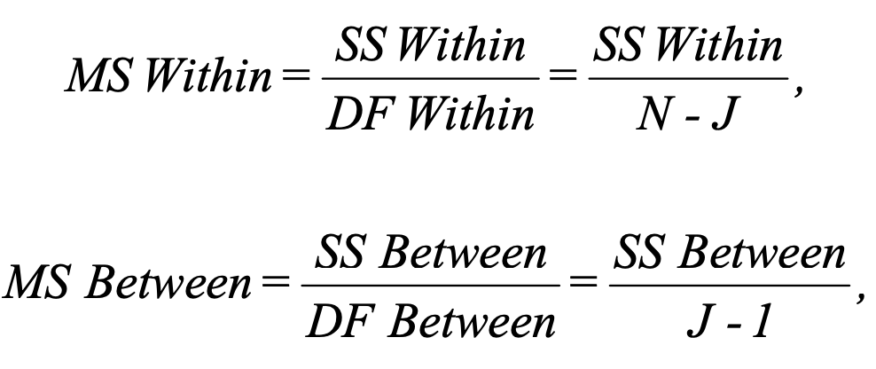

#### Step 3

Assumption for the random error term εᵢⱼ:
- εᵢⱼ ~ N(0, σ²)
- σ² is the same for all samples
- εᵢⱼ are independent

Then if H₀ is true:

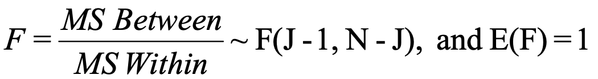

That is, if H₀ is true, the test statistic F follows F distribution with J - 1 and N - J degrees of freedom.

#### Step 4

We determine the critical value of the test statistic for a given value of α.
If the test statistic is less than the critical value, we accept H₀, if it is greater than the critical value we reject H₀.

#### Summary

Below is a summary of procedure for ANOVA:

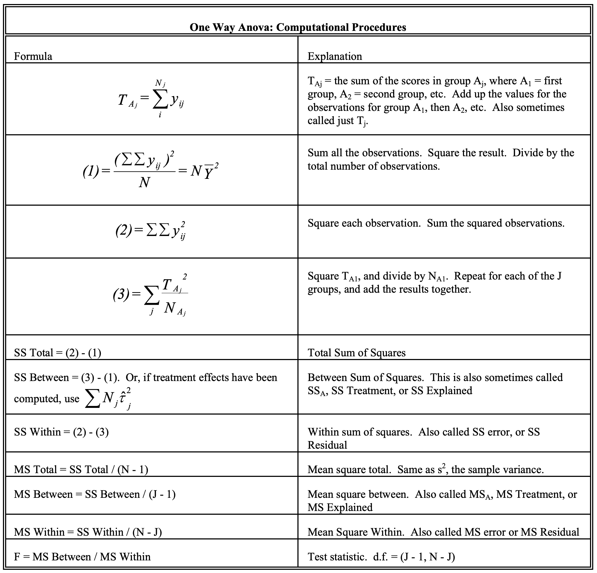

### Example

    A firm wishes to compare four programs for training workers to perform a certain manual
    task. 20 new employees are randomly assigned to the training programs, with 5 in each
    program. At the end of the training period, a test is conducted to see how quickly
    trainees can perform the task. The number of times the task is performed per minute is
    recorded for each trainee, with the following results:

        Program 1: 9, 12, 14, 11, 13
        Program 2: 10, 6, 9, 9, 10
        Program 3: 12, 14, 11, 13, 11
        Program 4: 9, 8, 11, 7, 8

    Using α = 0.05, determine whether the treatments differ in their effectiveness.

    Solution:

    Follow the procedure:
        Tᴀ₁ = 59
        Tᴀ₂ = 44
        Tᴀ₃ = 61
        Tᴀ₄ = 43

    (1) (∑∑yᵢⱼ)² / N = 207² / 20
                     = 2142.45
    (2) ∑∑yᵢⱼ² = 2239
    (3) ∑(ᴀⱼ²/Nᴀⱼ) = 2197.4

    J - 1 = 3
    N - J = 20 - 4 = 16

    F = MS Between / MS Within
      = (SS Between / (J - 1)) / (SS Within / (N - J))
      = ((3) - (1) / (J - 1)) / ((2) - (3) / (N - J))
      = ((2197.4 - 2142.45) / 3) / ((2239 - 2197.4) / 16)
      = 7.04

    For α = 0.05, critical value for F(3, 16) is 3.24.
    H₀ is rejected because F > 3.24

## Post Hoc Tests

In ANOVA (Analysis of Variance), the F-statistic tests if there is a significant difference between group means.
But it does not tell you where those differences are, e.g. group 1’s mean might be different than group 2’s mean but not different from group 3’s mean.

Pairwise T-tests can have misleading significance levels.
With 7 groups, you would expect at least 1 statistically significant difference even if no differences exist.

**Post hoc tests** are used to determine which specific group means differ significantly from each other.
These tests, also known as multiple comparison tests, help to pinpoint where the significant differences lie after the ANOVA has established that a general difference exists.

## Two-Way Analysis of Variance

Simultaneously examine the effects of two treatments (where both treatments have nominal-level measurement):
- The effect of sex and race on wages
    - Are there differences because of sex alone
    - Are there differences because of race alone
    - Are there differences attributable to particular combinations of sex and race
- The effects of the level of pollution and the level of city services on housing prices
- The effects of religion and region on income

Focus on the special case of balanced designs.
In a balanced design, all cell frequencies are equal, i.e. the number of observations in each combination of treatments is the same.
So, for example, there would be 5 white males, 5 black males, 5 white females, and 5 black females.

### Two-Treatments Model

When there are 2 treatments, the model can be written as:

    yᵢⱼₖ = μ + 𝜏ⱼ + λₖ + (𝜏λ)ⱼₖ + εᵢⱼₖ

    where
        μ = the grand mean
        𝜏ⱼ = the treatment effect for the jth category of the row variable
        λₖ - the treatment effect for the kth category of the column variable
        (𝜏λ)ⱼₖ = the interaction effect for the combination of the jth row category and
                 the kth column category.

The model can be further expanded:

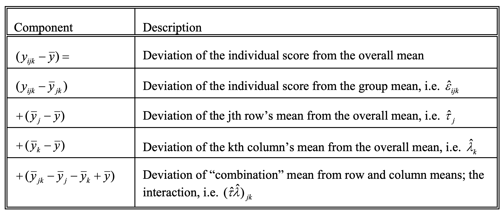

- Sum of square (SS) error:

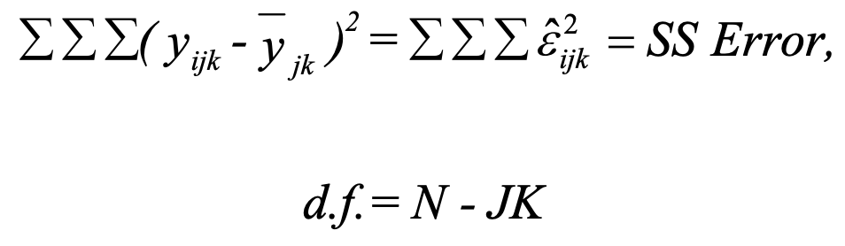

SS Error represents the deviation of individuals from the means of others who have the same value on the row and column variables (e.g. are of the same sex and race); that is, this represents the component of the scores that cannot be accounted for by group membership.
The degrees of freedom (d.f.) arise from the fact that there are N cases, and J*K means have to be estimated.

- SS Rows, SS Columns and SS Interaction:

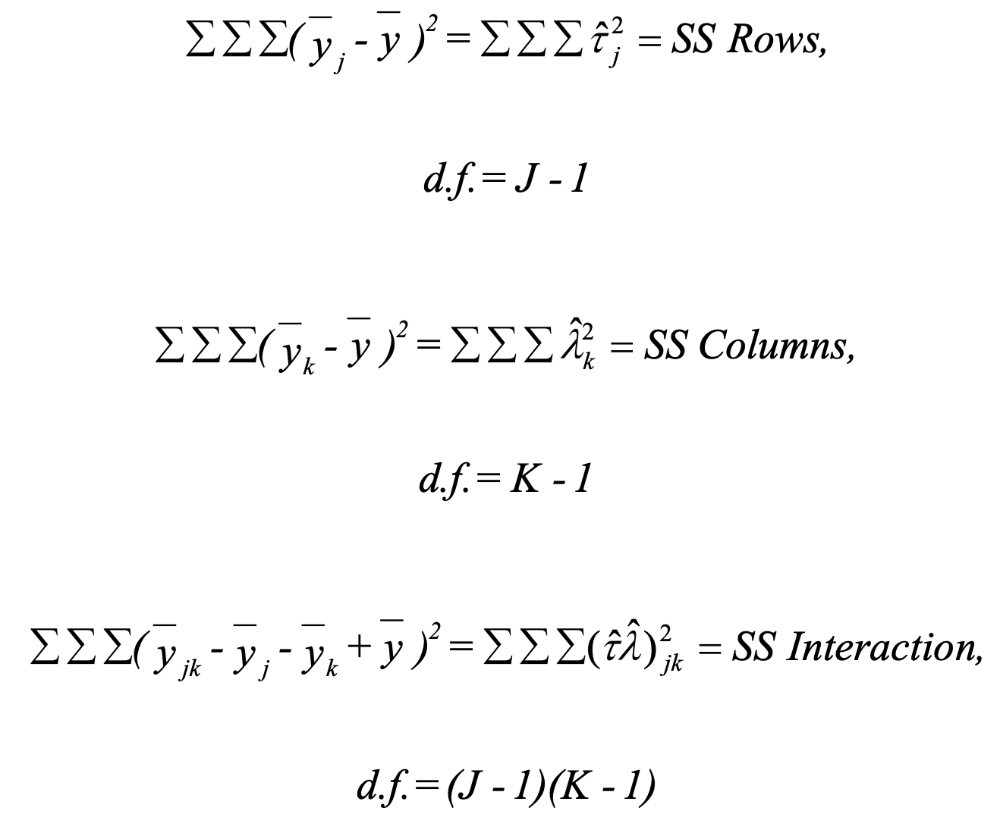

- SS Main and SS Total:

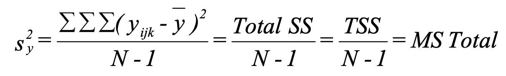

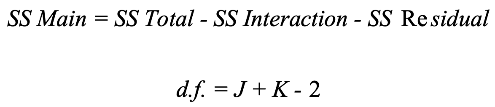

When all cell frequencies are equal(i.e. the number of observations in each combination of treatments is the same):

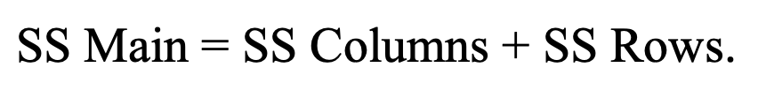

- SS Cells:

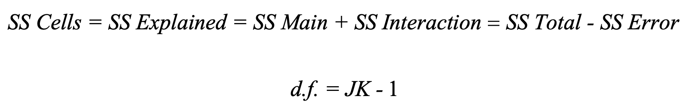

When all cell frequencies are equal:

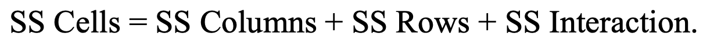

### Tests of Interest

#### 1 Row Column Interaction

Hypothesis:
- H₀: (𝜏λ)ⱼₖ = 0
- H₁: (𝜏λ)ⱼₖ ≠ 0

Test statistic:

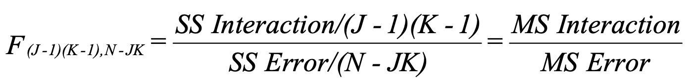

If the null hypothesis is true, F ~ F([J - 1][K - 1], N - JK)

#### 2 Row Effects

Hypothesis:
- H₀: 𝜏₁ = 𝜏₂ = 𝜏₃ ... = 𝜏ⱼ = 0
- H₁: some 𝜏ⱼ ≠ 0

Test statistic:

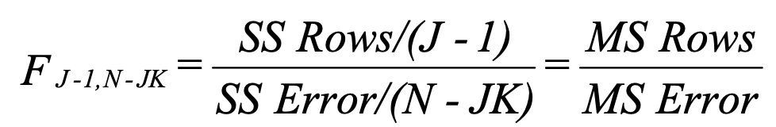

If the null hypothesis is true, F ~ F([J - 1], N - JK)

#### 3 Column Effects

Hypothesis:
- H₀: λ₁ = λ₂ = λ₃ ... = λₖ = 0
- H₁: some λₖ ≠ 0

Test statistic:

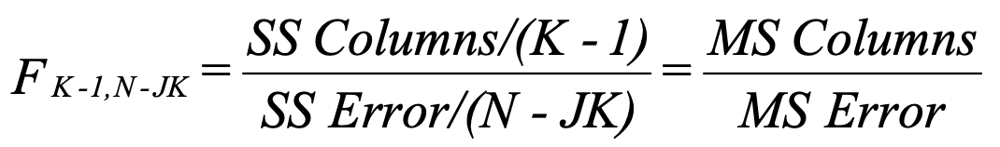

If the null hypothesis is true, F ~ F([K - 1], N - JK)

Note: row and column effects tests are primarily of interest if you conclude that interaction effects are not significant.
If, on the other hand, you conclude that the interaction effects do not equal zero, then you know both treatments (i.e. the row and column effects) are significant.

#### 4 Main Effects

Hypothesis:
- H₀: all λ and 𝜏 = 0
- H₁: some λ or 𝜏 ≠ 0

Test statistic:

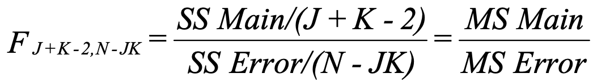

If the null hypothesis is true, F ~ F([J + K - 2], N - JK)

#### 5 Any Effects

Hypothesis:
- H₀: all λ, 𝜏, and (𝜏λ) = 0
- H₁: some λ, 𝜏 or (𝜏λ) ≠ 0

Test statistic:

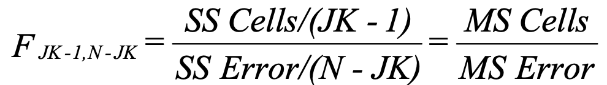

If the null hypothesis is true, F ~ F([JK - 1], N - JK)

### Example

    A researcher is interested in differences in income by Region (North, South, East, and West)
    and Religion (Catholic, Protestant, Other). She draws a sample of ten people for each
    combination of region and religion. She finds that SS Rows = 200, SS Columns = 170,
    SS Interaction = 100, and s² = 16.81.
    Which effects are significant at the 0.05 level?

    Solution:
    We are also told J = 4 (there are 4 regions), K = 3 (3 religions).
    We can deduce that N = J*K*10 = 120.

    Recall that s² = MS Total, and that MS Total = SS Total/(n-1), so:
        SS Total = s² * (N - 1) = 16.81 * 119 = 2000.

    SS Main is obtained by adding SS Rows + SS Columns:
        200 + 170 = 370
    SS Cells is obtained by adding up SS Columns + SS Rows + SS Interactions:
        200 + 170 + 100 = 470
    SS Error is obtained by computing SS Total - SS Cells:
        2000 - 470 = 1530
    The remaining quantities in the table are obtained by filling in the appropriate values for
    the formulas.

    Hence, we conclude (* = significant at the .05 level):
        Interaction effects are not significant, other effects are.

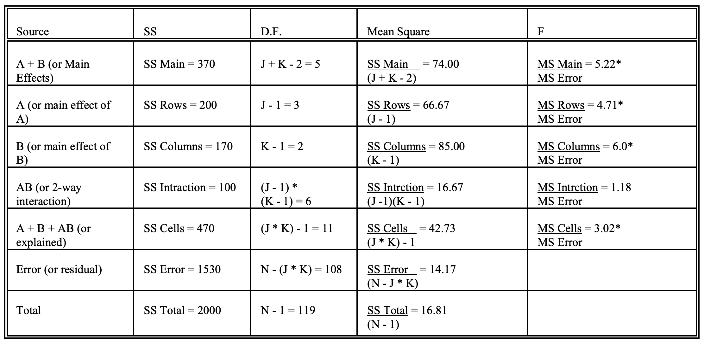
