<!---
nav:
    - Home=/
    - Statistics=/trading/statistics/note.md
left_pane: toc
--->

# 9 Bivariate Regression

The table summarizes the tools we have studied so far.
- T-Test, ANOVA study the relationships between populations to their means.
The purpose is to determine the estimated range of a mean, or compare the difference between means.
The independent variable is a category or population (an event belonging to a population is a nominal value) while the dependent variable is its interval measure (sample value).
- Categorical data analysis studies the relationship between populations to their categorical count.
The purpose is to determine whether populations of different categories have similar pattern.
The independent variable is a category or population while the dependent variable is the count (integer) in its classified category.

| Indep Var \ Dep Var  Pair# | Continuous     | Discrete            |
| -------------------------- | -------------- | ------------------- |
| Continuous                 | OLS Regression | Logistic Regression |
| Discrete                   | T-Test, ANOVA (population -> interval measusure) | Categorical Data Analysis (Chi-square: category -> count) |

This chapter exmine relationships between continuous dependent variables and continuous dependent variables.
For example, what will be the rate of return on investment? For each dollar invested, how much will sales increase?

To further clarify the concepts:
- T-Test treats all different investments as a single group, and studies its return's mean and variance.
- ANOVA goes further to divide investments into multiple groups, and studies the return (mean) comparison between groups.
- Chi-square divide both investments and returns into multiple groups, based on the count of each group pair, it studies the comparison between investment groups.
- OLS regression studies the average relationship between investment value and its return value.

## Ordinary Least Squares (OLS) Regression

Assume the relationship between the dependent variable (Y) and the independent variable (X) is linear:

    E(Y|X) = 𝛼 + βX

    where:
        E(Y|X) = the average value of Y for a given value of X
        β = slope coefficient (i.e. how much a 1-unit change in X affects the value of Y)
        𝛼 = intercept (i.e. the point where the regression line crosses the Y axis)

The graph shows the perfect linear relationship between X and Y:

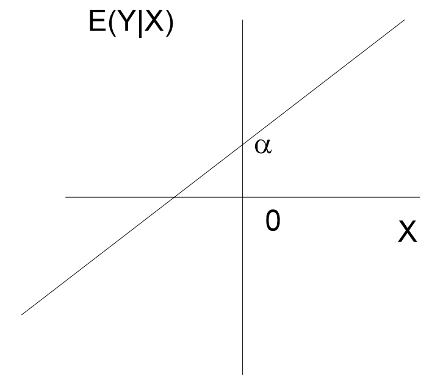

### The OLS Model

The true population parameters are unknown and need to be estimated from sample data.

    Sample regression line:
        Ŷ = α̂ + β̂X
    Sample regression model:
        yᵢ = α̂ + β̂xᵢ + ε̂ᵢ
           = ŷᵢ + ε̂ᵢ

OLS is the method to find values for 𝛼 and β so that to εᵢ is minimized:

    εᵢ = yᵢ - ŷᵢ
    ∑εᵢ² = ∑(yᵢ - ŷᵢ)²

Hence, best values for 𝛼 and β are:

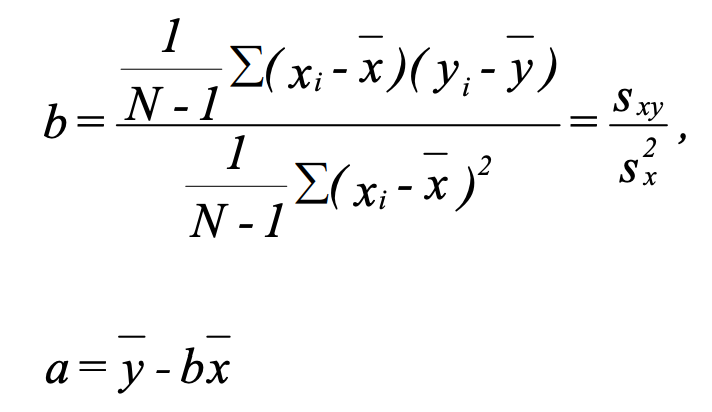

Given the above formula:
    When x = x̄:
        ŷ = 𝛼 + βx̄ = ȳ - βx̄ + βx̄ = ȳ
        The regression line includes (x̄, ȳ)
    When β = 0:
        ŷ = 𝛼 + βx = ȳ - βx̄ + βx = ȳ
        When slope is 0, the best estimate for y is ȳ.
        x has no impact on predicting y.

### Sample Estimation

Assumptions for hypothesis test:
1. Relationship between X and Y is linear.
2. ε has normal distribution.
3. E(ε) = 0, the average error is 0.
4. Cov(εᵢ, εⱼ) = 0, errors are independent.
5. V(εᵢ|xᵢ) = σ(ε)² for all x.
This is referred to as the assumption of **homoskedasticity**.
Populations that do not have a constant variance are heteroskedastic.

<mark hl>Gauss-Markov Theorem</mark>: if assumptions 1, 3, 4, and 5 hold true, then estimators a and b determined by the least squares method are **BLUE** (Best Linear Unbiased Estimate) i.e. they are unbiased and have the smallest possible variance.

#### 1 Compute SST and SP

SST stands for sum of squares total.
If subscript is missing, SSTy is assumed.
SP stands for sum of products.
Those are intermediate results used by later steps.

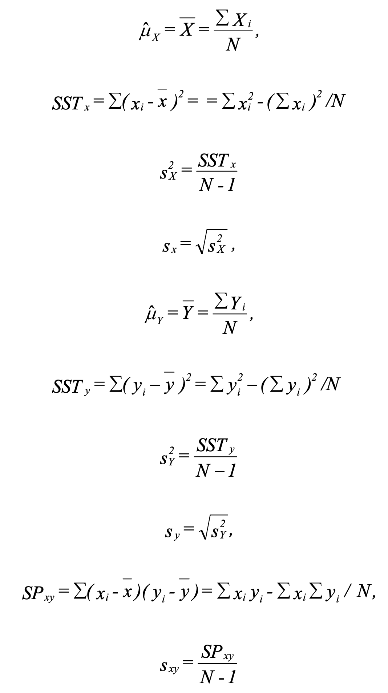

#### 2 Estimate 𝛼 and β

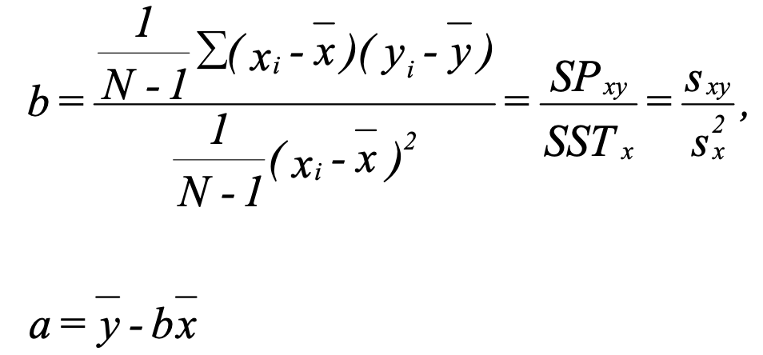

#### 3 Compute SSR and SSE

SSR stands for sum of squares regression (also called SS Explained).
SSE stands for sum of squares error.

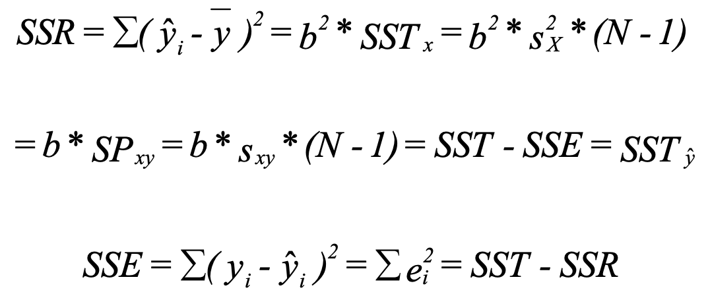

#### 4 Compute SEE

SEE stands for standard error of the estimate.

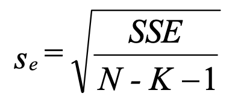

The value of sₑ can be interpreted in a manner similar to the sample standard deviation of the values of x about x̄.
Given that εᵢ ~ N(0, σₑ²), then:

- approximately 68.3% of the observations will fall within ±1sₑ units of the regression line
- 95.4% will fall within ±2sₑ units
- 99.7% will fall within ±3sₑ units

Using this gives one a good indication of the fit of the regression line to the sample data.
Note that increases in sample size increase both the numerator and the denomination, so sₑ is relatively unaffected by the size of the sample.

#### 5 Compute Standard Error of β

sᵦ is a measure of the amount of sampling error in the regression coefficient β.

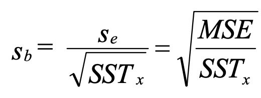

With sᵦ, we can then use t-test to test null hypothesis H₀: β = β₀.

Confidence interval for β:

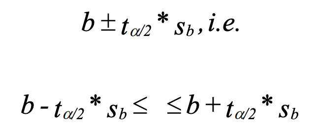

Test whether b significantly differs from 0:

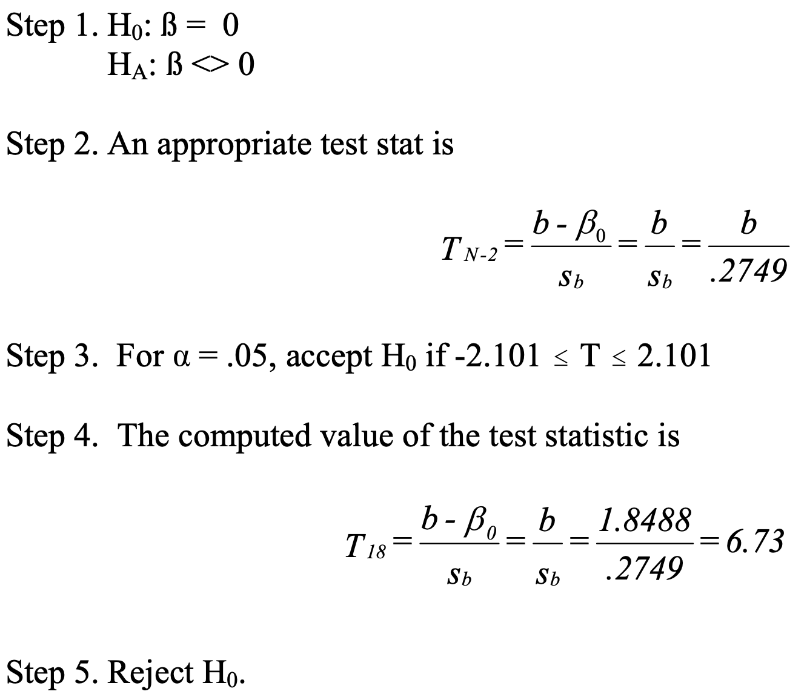

#### 6 Compute MST, MSR, and MSE for ANOVA Table

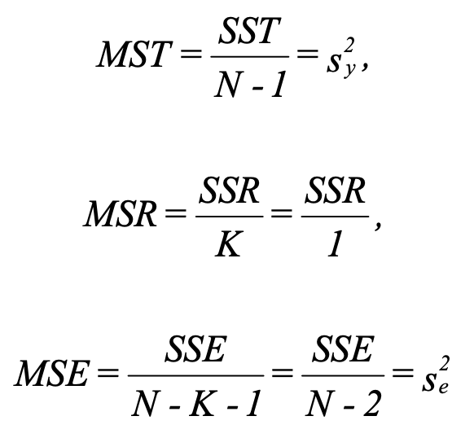

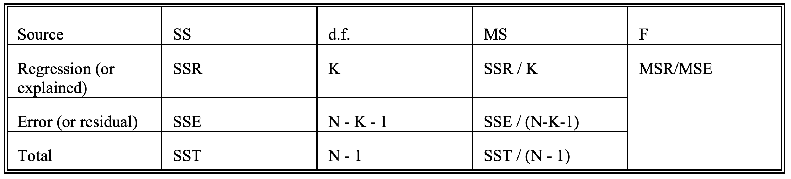

The F test tells if the regression effect is significant (the difference between ŷ and ȳ (the explained) relative to the difference between y and ŷ (the error)).
In other word, this test whether β is significantly different from 0 (no relationship when 0).

#### 7 Compute r

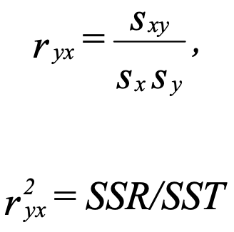

- r² is the proportion of variance in Y that is explained by X.
It is also called the **coefficient of determination**.
- It represents the strength of the linear relationship present in the data.
- The closer sampled y is to estimated ŷ, the bigger r².
- In a bivariate regression, r can range from -1 to 1, while r² ranges from 0 to 1.
